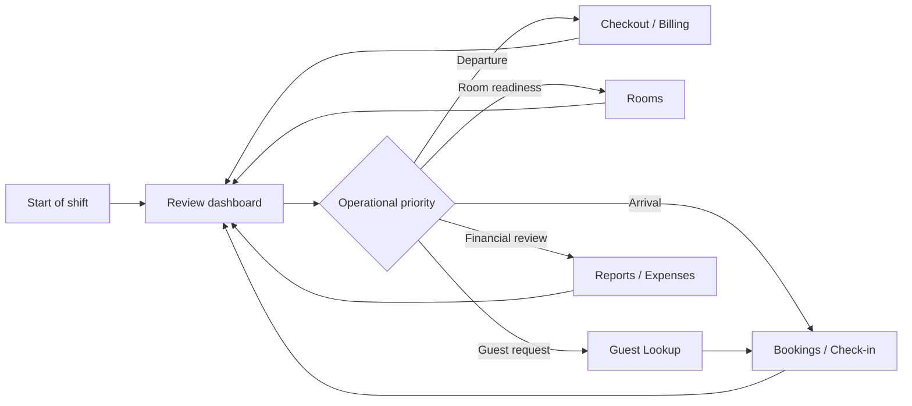
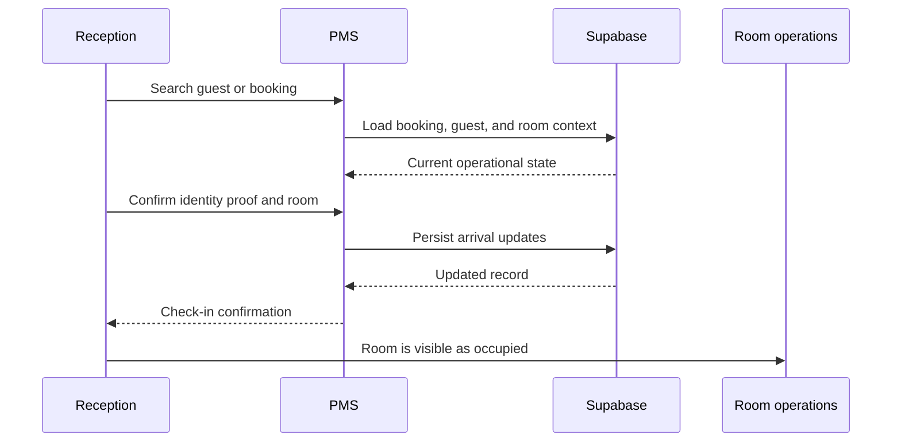
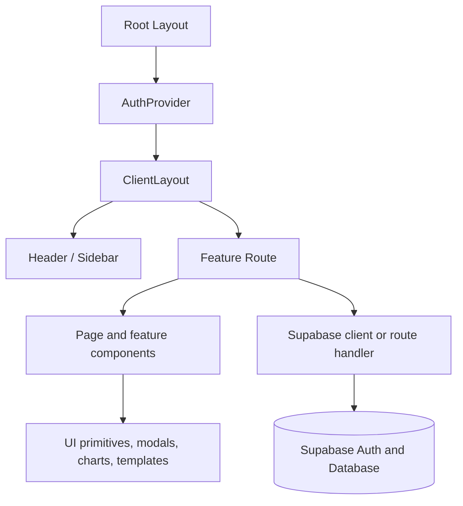
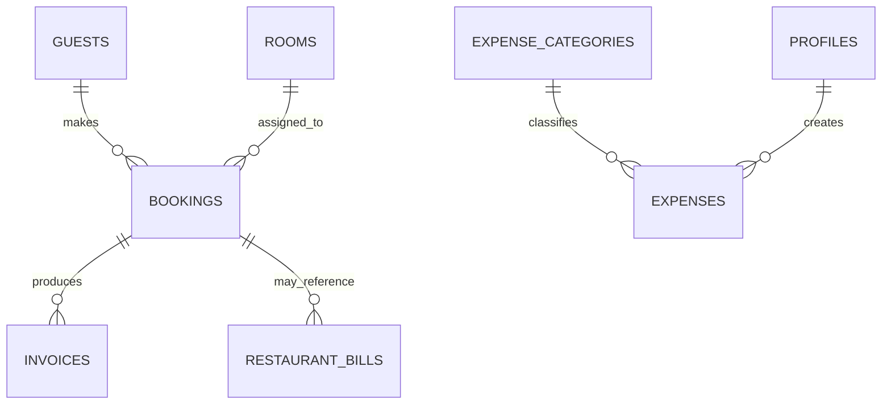
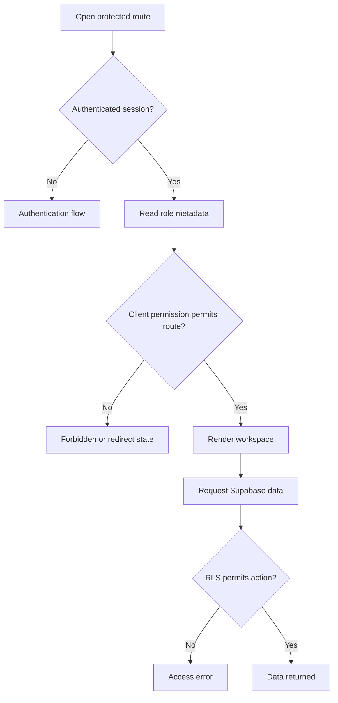
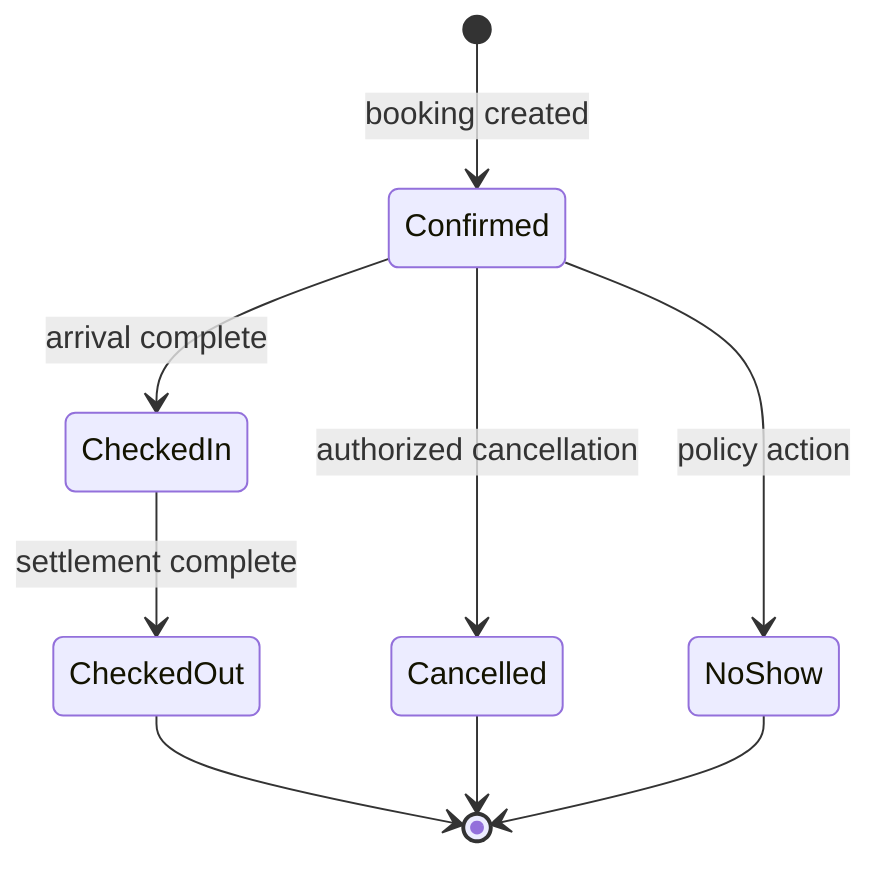
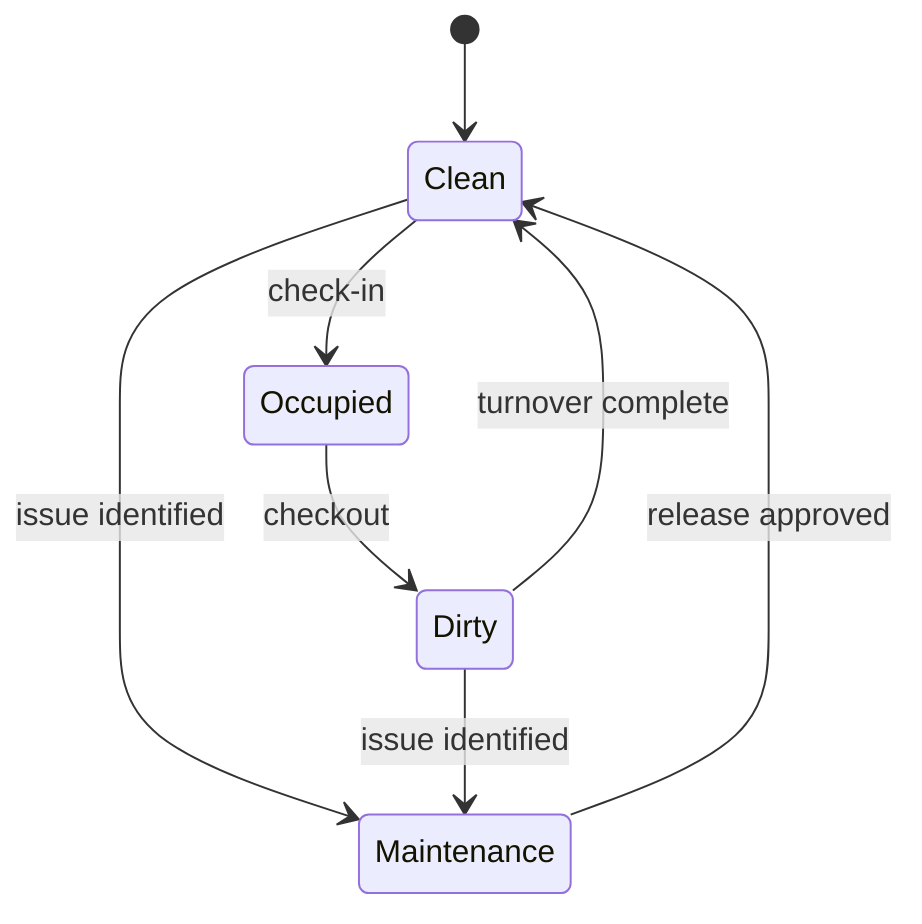
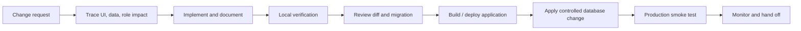

# Ave Vista Resort PMS

> A polished, operations-first property management workstation for boutique hotels and resorts.

Ave Vista Resort PMS brings reservations, front-desk operations, housekeeping, guest relationships, billing, restaurant POS, expenses, reporting, and daily closing into one modern workspace. It is designed for teams that want the speed of a focused operational tool without sacrificing the premium feel expected of a hospitality brand.

## Experience at a glance

- **One operational workspace** ? move from availability to reservation, guest profile, check-in, folio, invoice, and checkout without switching systems.
- **Luxury-minded interface** ? spacious layouts, refined typography, soft elevation, purposeful color, responsive cards, and consistent feedback states make dense hotel data easy to scan.
- **Modern form experience** ? unified controls, including elevated dropdown fields with a custom chevron, clear hover state, strong keyboard focus, and a readable disabled state.
- **Built for day-to-day hospitality** ? prioritize arrivals, departures, room readiness, guest history, receivables, dining charges, and cash-control tasks.
- **Role-aware access** ? Admin, Manager, and Reception workspaces are restricted according to each team member?s operational remit.
- **Installable PWA** ? use it as an installable web app with offline-aware UI and service-worker support in production.

## Product walkthrough

### 1. Sign in and secure access

Users authenticate through Supabase Auth. Sign-up captures the user?s full name and operational role; signed-in state is maintained by the app-wide auth provider. Permissions are applied to application paths for the following roles:

| Role | Primary scope |
| --- | --- |
| **Admin** | Full access to all areas, configuration, reporting, and management workflows. |
| **Manager** | Dashboard, bookings, rooms, guests, guest lookup, restaurant billing, reports, expenses, help, and profile. |
| **Reception** | Dashboard, bookings, rooms, guests, guest lookup, front desk, billing, restaurant billing, expenses, help, and profile. |

### 2. Begin from the executive dashboard

The dashboard is the visual pulse of the property. It surfaces quick statistics, occupancy analytics, room-status mix, check-in/check-out activity, revenue trend context, expenses, recent activity, live operations, and shortcut actions. The interface is designed to turn a status check into an actionable next step.

### 3. Manage reservations from availability to confirmation

The bookings workspace combines an availability calendar, booking list, booking detail view, and new-booking workflow. Reservations can be created against the selected dates and available inventory while guest details, occupancy, booking type, pricing, and advance amounts are captured in the same flow.

The booking workflow supports:

- date-aware room availability and overlapping-booking checks;
- multi-room booking selection, including full-resort room logic;
- guest search and reuse of existing guest information;
- walk-in, direct, OTA, and other booking-source capture;
- booking detail review, editing, and status tracking;
- clear visual states for selected rooms and confirmed activity.

### 4. Operate the front desk

Front-desk check-in is a guided flow for finding a reservation, reviewing the selected guest, validating government ID proof details, assigning or confirming a room, and progressing the arrival. The checkout experience focuses on active folios: select a departing guest, review charges, choose payment mode, finalize the transaction, update the room for turnover, and generate the invoice output.

### 5. Keep rooms ready

The rooms module provides room inventory and housekeeping-oriented status tracking. Staff can review rooms as clean, occupied, dirty, or under maintenance; open detail context; and update room attributes from room-management dialogs. This supports a shared live view between reception and housekeeping.

### 6. Build a meaningful guest record

Guest management includes profiles, search, and a dedicated guest-lookup experience. The lookup flow brings together contact information, VIP context, identification fields, company/GST details, notes, and booking history, helping the team recognize returning guests and serve them consistently.

### 7. Control billing and invoices

Billing supports invoice review, payment-status filtering, linked booking context, source/channel selection, payment settlement, and payment instruments. Folio and invoice presentation components are available for a clean guest-facing document experience, while day-to-day filters help users focus on the invoices that need action.

### 8. Run restaurant operations

Restaurant Menu manages dining items, categories, availability, and sorting. Restaurant Bill provides a point-of-sale-style workflow for building a bill, attaching it to a guest or room where appropriate, choosing a payment mode, and producing a polished receipt template.

### 9. Track expenses and close the day

Expenses include category management, expense entry, optional attachment handling, list filtering, analytics, summaries, export utilities, and dashboard reporting. Daily closing/reporting components help operations consolidate revenue, costs, and movement into a practical review workflow.

## Interface and design system

The visual system intentionally balances resort polish with operational speed.

| Design principle | How it appears in the product |
| --- | --- |
| **Calm hierarchy** | Blue-sky primary colors, quiet neutrals, and intentional spacing make operational information easy to prioritize. |
| **Tactile controls** | Cards, modals, tabs, filters, and fields use rounded geometry, subtle shadows, and clear state changes. |
| **Readable density** | Responsive grids, concise labels, chips, compact data groupings, and strong empty states help staff scan quickly. |
| **Consistent feedback** | Loading screens, progress feedback, offline banner, hover states, focus rings, and error/empty states reduce uncertainty. |
| **Accessible interaction** | Native form semantics are retained where useful; visible focus treatment and touch-friendly control heights support keyboard and tablet workflows. |
| **Responsive by default** | Layouts adapt to smaller screens via CSS modules and mobile-aware UI components, while retaining workstation-level data visibility. |

### Dropdown and form treatment

Every standard native select in the product inherits a shared modern visual treatment. The field has a minimum 44px touch target, custom blue chevron, 12px rounded corners, a refined border and inset highlight, smooth hover feedback, and a highly visible focus ring. Existing form behavior and browser-native accessibility are preserved. Component-level styles can continue to define layout, while the global selector ensures a consistent control language across bookings, billing, rooms, restaurant, reports, profile, settings, and front-desk screens.

## Application map

| Area | Route | Purpose |
| --- | --- | --- |
| Dashboard | `/` | Executive snapshot, occupancy, revenue, live operations, and shortcuts. |
| Bookings | `/bookings` | Availability calendar, reservation list, booking creation, and booking details. |
| Rooms | `/rooms` | Room inventory, status, details, and maintenance context. |
| Guests | `/guests` | Guest directory and guest profile history. |
| Guest Lookup | `/guest-lookup` | Fast guest search and consolidated guest context. |
| Front Desk | `/front-desk` | Front-desk operations landing area. |
| Check-in | `/front-desk/checkin` | Guided reservation selection and arrival workflow. |
| Check-out | `/front-desk/checkout` | Folio selection, settlement, turnover, and invoice workflow. |
| Billing | `/billing` | Invoice management, payment state, and filters. |
| Restaurant Menu | `/restaurant-menu` | Menu-item and category operations. |
| Restaurant Bill | `/restaurant-bill` | Restaurant POS-style billing and receipt output. |
| Expenses | `/expenses` | Expense entry, categorization, filters, analytics, and export. |
| Reports | `/reports` | Revenue, operating, and performance reporting. |
| Settings | `/settings` | Property and operational configuration. |
| Email Settings | `/settings/email` | Email-related configuration and templates. |
| Profile | `/profile` | User profile and personal preferences. |
| Help | `/help` | In-product guidance. |

## Technology

- **Framework:** Next.js 16 with React 19 and the App Router
- **Language:** TypeScript
- **Styling:** Vanilla CSS and CSS Modules, with global design tokens
- **Data and Auth:** Supabase JavaScript client and Supabase Auth
- **Motion:** Framer Motion
- **Icons:** Lucide React
- **Charts:** Recharts
- **Email:** Nodemailer and Resend integration points
- **Documents:** PDF-Lib plus invoice and restaurant-bill templates
- **PWA:** `@ducanh2912/next-pwa`
- **Deployment:** Vercel configuration included, with Mumbai (`bom1`) deployment region configured

## Architecture

```text
Browser / Installed PWA
        ?
        ??? Next.js App Router pages
        ?     ??? operational workspaces (bookings, rooms, billing, POS?)
        ?     ??? reusable UI components and CSS Modules
        ?     ??? AuthProvider + role-aware client layout
        ?
        ??? Next.js route handlers
        ?     ??? expense and email endpoints
        ?
        ??? Supabase
              ??? Auth sessions and user metadata
              ??? relational operational data
              ??? row-level security policies
              ??? SQL migrations, schemas, seeds, and diagnostic queries
              ??? Edge Functions for scheduled / email workflows
```

### Repository layout

```text
src/
  app/          App Router routes, layouts, API handlers, global styling
  components/   Feature components, modals, templates, dashboard and UI primitives
  contexts/     Authentication state and user context
  hooks/        Reusable browser/UI hooks
  lib/          Supabase client, permission map, services, exports, types, constants
  types/        Shared TypeScript types
supabase/
  schemas/      Base database schemas, RLS policies, RPC definitions
  migrations/   Incremental database changes
  seeds/        Dummy and room/expense seed data
  queries/      Verification and diagnostic SQL
  functions/    Supabase Edge Functions
docs/           Feature-specific implementation documentation
scripts/        Verification, data-check, and utility scripts
public/         PWA assets, icons, service worker artifacts, and static files
```

## Local setup

### Prerequisites

- Node.js 20 LTS or later
- npm 10 or later
- A Supabase project
- Optional: SMTP credentials for the email route

### Install and configure

1. Clone the repository and enter it.

   ```bash
   git clone <your-repository-url>
   cd ave-vista-pms
   ```

2. Install dependencies.

   ```bash
   npm install
   ```

3. Create `.env.local` in the project root.

   ```dotenv
   NEXT_PUBLIC_SUPABASE_URL=https://<project-ref>.supabase.co
   NEXT_PUBLIC_SUPABASE_ANON_KEY=<your-supabase-anon-key>

   # Optional: required when using the in-app email route
   SMTP_HOST=smtp.gmail.com
   SMTP_PORT=465
   SMTP_USER=operations@example.com
   SMTP_PASS=<smtp-app-password>
   ```

4. Provision the database in Supabase. Start with the SQL files in `supabase/schemas`, then apply the relevant scripts in `supabase/migrations`. Use `supabase/seeds` only when development/demo data is needed.

5. Start the development server.

   ```bash
   npm run dev
   ```

6. Open [http://localhost:3000](http://localhost:3000), create or sign in with a user, and verify the role metadata matches the intended workspace permissions.

### Available commands

| Command | Description |
| --- | --- |
| `npm run dev` | Start the local Next.js development server. |
| `npm run build` | Create a production build. |
| `npm run start` | Run the production server after a build. |
| `npm run lint` | Run ESLint across the project. |

## Database, authorization, and security

Supabase is the system of record for operational data and authentication. The repository includes SQL assets for core schemas, invoice data, restaurant menu and bills, settings, email, amenities, dashboard RPCs, and row-level security.

- Use only the public Supabase URL and anon key in `NEXT_PUBLIC_*` variables.
- Keep SMTP passwords and all privileged service keys out of the client and out of Git.
- Apply row-level security policies deliberately in each environment; the `supabase/schemas` directory contains the policy definitions used by this project.
- The client permission map improves navigation UX, but database RLS is the enforcement boundary for data access.
- Confirm user role metadata at sign-up/admin provisioning time, because it drives the client?s route permission model.

## Email and notifications

The email route uses configurable SMTP values and falls back to Gmail defaults for host and port. Email settings and templates are backed by the application?s Supabase configuration. Before enabling production delivery, verify sender domain/authentication, test recipient routing, and confirm that credentials are held only in deployment environment variables.

## PWA and offline behavior

The project is configured as a Progressive Web App. In production, the PWA plugin emits service-worker assets under `public`, supports installable standalone display, caches front-end navigation, reloads when connectivity returns, and surfaces an offline-aware banner through the UI. The PWA plugin is disabled in development to keep local iteration predictable.

## Deployment

The repository contains `vercel.json` configured for Next.js builds and the Mumbai region (`bom1`).

1. Create a Vercel project connected to this repository.
2. Add all Supabase and SMTP environment variables in the Vercel project settings.
3. Confirm the Supabase Auth site URL and redirect URLs include your production domain.
4. Apply database schemas and migrations to the production Supabase project before release.
5. Deploy using Vercel?s Git integration or the Vercel CLI.
6. Smoke-test sign-in, dashboard data, reservation creation, check-in/out, billing, restaurant billing, expense entry, and email delivery after deployment.

## Quality checklist

Before release, check the complete hospitality workflow:

- [ ] Admin, Manager, and Reception accounts see only their allowed navigation paths.
- [ ] A new guest and booking can be created from availability through confirmation.
- [ ] Room status changes reflect correctly in rooms and operational dashboard views.
- [ ] Check-in captures required identity information and room selection.
- [ ] Checkout calculates settlement correctly, creates the invoice, and moves the room to turnover state.
- [ ] Billing filters and payment instruments produce the expected invoice state.
- [ ] Restaurant item availability and POS billing operate as expected.
- [ ] Expenses appear in summaries, analytics, and exports.
- [ ] Dropdowns, keyboard focus, mobile layouts, offline notice, loading states, and empty states remain usable.
- [ ] Supabase RLS policies and environment variables are correct for the target environment.

## Troubleshooting

| Symptom | What to check |
| --- | --- |
| Supabase warning or no data | Confirm `NEXT_PUBLIC_SUPABASE_URL` and `NEXT_PUBLIC_SUPABASE_ANON_KEY` in `.env.local`, then restart the dev server. |
| User cannot access a page | Verify their `role` user metadata and the matching path in `src/lib/permissions.ts`. |
| Data request is rejected | Check that the relevant schema/migration has been applied and that RLS policy permits the authenticated action. |
| Email does not send | Verify SMTP credentials, port/security compatibility, sender policy, and recipient configuration in settings. |
| PWA changes seem stale | Test a production build, unregister the prior service worker during local diagnostics, then reload. |
| Styling looks unchanged | Ensure the active route has reloaded; standard selects receive their global design treatment from `src/app/globals.css`. |

## Documentation and contribution notes

Feature implementation notes live in [`docs/`](./docs), while database assets and verification scripts live in [`supabase/`](./supabase) and [`scripts/`](./scripts). Keep feature changes cohesive: update the associated route/component, CSS module or design token, data/RLS asset where needed, and this README whenever a user-facing workflow or setup requirement changes.

---

Built for the rhythm of a resort: calm for the guest, clear for the team, and ready for the next check-in.

# Complete Operating Handbook

This handbook is the detailed reference for operating, extending, testing, and deploying Ave Vista Resort PMS. It complements the product overview above with the decisions, checks, and handoffs used in daily property operations.

## Handbook navigation

- Operating model and guest journey
- Daily reception, housekeeping, manager, and administrator playbooks
- Architecture, authorization, and lifecycle diagrams
- UX specification for forms, dropdowns, feedback, and responsive layouts
- Data, database, security, development, release, support, and A?Z references
- Source, SQL, scripts, and documentation catalogue

## Operating model

The system is organized around the next operational decision. A booking informs availability, guest context, check-in, room status, billing, checkout, and reporting. Every update should make the next team member?s work clearer.

1. **Use operational truth.** Check booking and room state before assigning, checking in, settling, or changing availability.
2. **Keep guest context connected.** Reuse a verified guest record instead of creating duplicates.
3. **Use focused workspaces.** Start from the dashboard, then open the relevant booking, room, guest, billing, restaurant, or expense area.
4. **Verify after saving.** Confirm the business result, not only a successful button click.
5. **Secure data at the source.** Role-aware navigation improves UX; Supabase RLS must protect database access.



## Guest journey playbook

### 1. Prepare rooms and availability

**Owner:** Manager, reception, and housekeeping.

- Review clean, occupied, dirty, and maintenance room states.
- Confirm rooms marked saleable are truly ready to sell.
- Check booking availability for requested dates before making a guest commitment.
- Resolve room conflicts and maintenance issues before the arrival rush.
- Keep the room type, capacity, price, and inventory data accurate.

**Exit condition:** the team can identify a room that is both available in the system and operationally ready.

### 2. Identify or create the guest

**Owner:** Reception.

- Search by name, phone, email, identity information, or company context.
- Select an existing record only when the match is reliable.
- Create a new guest only when no verified record exists.
- Capture contact and identity data in line with property policy.
- Use VIP, notes, company, GST, and address context only for legitimate service/operational needs.

**Control:** similar names are not enough to identify a guest. Verify with stronger identifiers before editing or checking in.

### 3. Create the booking

**Owner:** Reception or Manager.

- Select valid check-in and check-out dates.
- Review returned availability and select one or more intended rooms.
- Choose an existing guest or capture new guest information.
- Enter booking type, source/channel, guest count, room rate, extra-pax details, advance, and total where applicable.
- Confirm the submission, then reopen the booking list/detail to verify dates, rooms, pricing, and status.

**Control:** availability logic is a decision aid. The saved booking result is the operational confirmation.

### 4. Check in

**Owner:** Reception.



- Search for and select the exact booking.
- Confirm guest name, dates, guest count, room, and booking state.
- Capture or confirm government ID proof details according to property policy.
- Confirm the selected room is ready; escalate if it is dirty or under maintenance.
- Complete the guided arrival flow and verify the booking/room state afterward.

### 5. Serve the in-stay guest

**Owner:** Reception, restaurant staff, manager.

- Use Guest Lookup to view safe, relevant context and booking history.
- Record restaurant bills and payment context through the restaurant workflow.
- Use Billing to review invoices and settlement status.
- Record operating costs in Expenses with a specific category and supporting evidence where required.
- Keep rooms current whenever a housekeeping or maintenance condition changes.

### 6. Check out and settle

**Owner:** Reception.

- Select the correct active folio/booking.
- Review room rate, stay dates, extra-pax charges, payments, and current balance.
- Confirm payment mode/instrument with the guest before finalizing.
- Generate invoice output where required.
- Complete checkout and verify the room returns to turnover/dirty status.
- Inspect Billing if a partial, pending, or disputed condition remains.

### 7. Close the operational loop

**Owner:** Manager or Admin.

- Review outstanding invoices and exception bookings.
- Confirm checkout rooms are progressing through turnover.
- Review revenue and expense context in reporting/daily-closing workflows.
- Preserve guest history for future recognition, subject to property privacy requirements.

## Daily role playbooks

### Reception opening

- Sign in, check network/offline state, and verify correct role.
- Review dashboard arrivals, departures, live operations, and room status.
- Open Bookings for imminent arrivals and Billing for unsettled departures.
- Coordinate dirty/maintenance rooms before accepting same-day booking commitments.
- Keep sensitive guest information off public screens and printouts.

### Reception departure

- Match the guest to the correct active booking/folio.
- Read all charge/payment fields before discussing settlement.
- Confirm payment mode and instrument.
- Issue or locate the invoice as required.
- Verify the room status moves to turnover/dirty after checkout.
- Escalate disputes, failed payment, or partial settlement immediately.

### Housekeeping and room control

- Prioritize rooms needed for upcoming arrivals.
- Mark maintenance accurately; an unavailable room must not appear sellable.
- Change a room to clean only after turnover is genuinely complete.
- Communicate ambiguous or urgent status changes to reception/manager.

### Manager

- Review shift health: occupancy, arrivals, departures, room readiness, revenue, expenses, and exceptions.
- Audit high-value, multi-room, corporate, complimentary, and unusual bookings.
- Review daily-closing context before declaring an operational day complete.
- Ensure staff use appropriate roles and do not share credentials.

### Administrator

- Maintain room inventory, property settings, user roles, and environment configuration.
- Apply schema/migration changes only through a controlled process.
- Protect deployment, SMTP, and Supabase credentials.
- Keep RLS policies aligned with actual operating responsibility.

## Architecture diagrams







## State models





Status names and available transitions can change with the schema and business policy. Before adding a status, inspect every filter, dashboard query, report, and workflow that relies on existing values.

## Interface specification

### Design language

| Element | Product rule |
| --- | --- |
| Color | Ocean/sky primary blue, quiet blue-gray backgrounds, restrained accent orange, and named status colors. |
| Type | Geist sans and mono fonts with strong hierarchy and readable data density. |
| Space | Use existing spacing tokens to keep cards, forms, modals, and dashboard grids aligned. |
| Shape | Use soft rounded geometry: compact controls and larger cards/dialogs. |
| Depth | Prefer subtle borders and shadows; reserve stronger elevation for menus and dialogs. |
| Motion | Keep transitions short and purposeful; motion should clarify state, not delay work. |

### Dropdown standard

Every standard single-choice native select shares a global polished treatment:

- 44px minimum touch target;
- 12px rounded field shape;
- custom blue chevron;
- white surface, blue-gray border, and inset highlight;
- brighter hover feedback;
- high-visibility blue focus ring;
- muted disabled state; and
- native select semantics for keyboard, screen reader, and mobile-picker reliability.

Multiple selects are excluded from the treatment so they keep their appropriate platform behavior. The styling lives in `src/app/globals.css` and intentionally complements route-specific CSS modules.

### Accessibility and responsive checks

- Keep visible keyboard focus on every interactive control.
- Pair every input/select with an explicit label.
- Do not communicate room/payment state through color alone.
- Preserve logical tab order in dialogs and booking flows.
- Verify layouts at narrow mobile width and at 200% browser zoom.
- Use native buttons for actions and links for navigation.
- Show loading, no-result, empty, offline, error, and disabled states deliberately.

## Data, security, and delivery runbook

### Data and API boundary

The browser Supabase client is initialized from `NEXT_PUBLIC_SUPABASE_URL` and `NEXT_PUBLIC_SUPABASE_ANON_KEY`. These public client values enable the browser connection but do not grant unrestricted data access. Database row-level security is the enforcement boundary.

- Keep a Supabase service-role key out of client code and out of every `NEXT_PUBLIC_*` variable.
- Put server-side secret handling in route handlers or controlled Supabase Edge Functions.
- Validate route-handler input and return actionable, non-sensitive errors.
- Create named incremental SQL migrations for production schema changes.
- Test migrations, policy changes, and seeds against a non-production project first.
- Treat seed data as development/demo-only data; never run dummy-data scripts against the live property database.

### Security controls

| Control | Required practice |
| --- | --- |
| Authentication | Use Supabase Auth sessions; configure password, verification, and MFA policy in Supabase for the property. |
| Client permissions | Keep `src/lib/permissions.ts` aligned with operational roles and test direct route navigation. |
| Database access | Enforce reads/writes through least-privilege RLS policies. |
| Secrets | Store Supabase, SMTP, and integration credentials in `.env.local` locally and deployment secrets in production. |
| Guest privacy | Do not log, screenshot, or share guest identity/contact/payment data without a legitimate approved purpose. |
| Deployment | Confirm target Vercel and Supabase projects before release or migration. |

### Release runbook



1. Inspect `git status` before editing and protect unrelated work.
2. Trace the route, component, service, schema, RLS policy, and report affected by the change.
3. Run appropriate local checks and document existing baseline failures separately from your change.
4. Review `git diff --check` and confirm no secret or guest data is included.
5. Apply additive database changes before application code that depends on them.
6. Deploy, then smoke-test sign-in, booking, room update, front-desk flow, billing, restaurant bill, expense, and report paths relevant to the release.
7. Roll back app builds through the deployment platform when needed; use a compensating migration for database changes rather than assuming an app rollback reverses data.

### Support and incident response

| Severity | Example | First response |
| --- | --- | --- |
| S1 | Property-wide sign-in/check-out failure or suspected data exposure | Contain, notify owners, preserve safe facts, rotate exposed credentials. |
| S2 | Key workflow failure affecting a role/shift or multiple operational records | Provide same-shift mitigation, investigate, and deploy controlled fix. |
| S3 | Non-blocking visual/filter/report issue | Capture evidence and schedule a verified correction. |
| S4 | Enhancement/design request | Record expected operational outcome and prioritize normally. |

Support ticket minimum facts: time/timezone, user role, route, attempted action, expected versus actual result, safe record reference, network state, and whether an attached screenshot has been redacted.

### A?Z quick reference

| Term | Meaning and operating cue |
| --- | --- |
| Availability | Saleable room inventory for a date range; verify both system availability and room readiness. |
| Booking source | Channel such as direct, walk-in, website, or OTA; record accurately for reconciliation. |
| Check-in | Guided arrival action that confirms guest/identity/room and moves the stay into occupancy. |
| Daily closing | Manager review of revenues, expenses, exceptions, and outstanding work?not a blind click-through. |
| Expense | Operating cost that must have correct category, amount, date, payment mode, and evidence if required. |
| Folio | Active guest settlement context; confirm guest and room before taking payment. |
| Guest lookup | Consolidated guest context; use only for legitimate hospitality operations. |
| Housekeeping status | Truthful room readiness state; protects availability and guest experience. |
| Invoice | Billing output; inspect payment state and linked booking before presenting it. |
| RLS | Row-level security; required database enforcement layer beyond client navigation. |
| Turnover | Post-checkout room handoff; keep unavailable until cleaning/maintenance work is complete. |
| Walk-in | New on-property reservation; apply the same identity, inventory, rate, and payment controls. |

## Source and database catalogue

This catalogue is an implementation map. Each entry should be read with its imports, callers, paired CSS module, relevant service, and related SQL before being modified. Paths are generated from the current repository, so this section also doubles as a change-discovery index.

### Application source files
### `src\app\(auth)\forgot-password\page.module.css`
- **Layer:** Shared source unit.
- **Responsibility:** Implements part of the capability indicated by this route/component/service path.
- **Before changing:** Inspect imports, callers, paired styles, related data selections, and the owning user workflow.
- **Operational impact:** Consider user role, loading/error/empty/offline states, responsive behavior, and data privacy.
- **Verification:** Exercise the corresponding screen or behavior with safe data and review the diff for unintended scope.

### `src\app\(auth)\forgot-password\page.tsx`
- **Layer:** Shared source unit.
- **Responsibility:** Implements part of the capability indicated by this route/component/service path.
- **Before changing:** Inspect imports, callers, paired styles, related data selections, and the owning user workflow.
- **Operational impact:** Consider user role, loading/error/empty/offline states, responsive behavior, and data privacy.
- **Verification:** Exercise the corresponding screen or behavior with safe data and review the diff for unintended scope.

### `src\app\(auth)\login\page.module.css`
- **Layer:** Shared source unit.
- **Responsibility:** Implements part of the capability indicated by this route/component/service path.
- **Before changing:** Inspect imports, callers, paired styles, related data selections, and the owning user workflow.
- **Operational impact:** Consider user role, loading/error/empty/offline states, responsive behavior, and data privacy.
- **Verification:** Exercise the corresponding screen or behavior with safe data and review the diff for unintended scope.

### `src\app\(auth)\login\page.tsx`
- **Layer:** Shared source unit.
- **Responsibility:** Implements part of the capability indicated by this route/component/service path.
- **Before changing:** Inspect imports, callers, paired styles, related data selections, and the owning user workflow.
- **Operational impact:** Consider user role, loading/error/empty/offline states, responsive behavior, and data privacy.
- **Verification:** Exercise the corresponding screen or behavior with safe data and review the diff for unintended scope.

### `src\app\(auth)\reset-password\page.tsx`
- **Layer:** Shared source unit.
- **Responsibility:** Implements part of the capability indicated by this route/component/service path.
- **Before changing:** Inspect imports, callers, paired styles, related data selections, and the owning user workflow.
- **Operational impact:** Consider user role, loading/error/empty/offline states, responsive behavior, and data privacy.
- **Verification:** Exercise the corresponding screen or behavior with safe data and review the diff for unintended scope.

### `src\app\(auth)\signup\page.tsx`
- **Layer:** Shared source unit.
- **Responsibility:** Implements part of the capability indicated by this route/component/service path.
- **Before changing:** Inspect imports, callers, paired styles, related data selections, and the owning user workflow.
- **Operational impact:** Consider user role, loading/error/empty/offline states, responsive behavior, and data privacy.
- **Verification:** Exercise the corresponding screen or behavior with safe data and review the diff for unintended scope.

### `src\app\api\auth\user-role\route.ts`
- **Layer:** Shared source unit.
- **Responsibility:** Implements part of the capability indicated by this route/component/service path.
- **Before changing:** Inspect imports, callers, paired styles, related data selections, and the owning user workflow.
- **Operational impact:** Consider user role, loading/error/empty/offline states, responsive behavior, and data privacy.
- **Verification:** Exercise the corresponding screen or behavior with safe data and review the diff for unintended scope.

### `src\app\api\daily-closing\metrics\route.ts`
- **Layer:** Shared source unit.
- **Responsibility:** Implements part of the capability indicated by this route/component/service path.
- **Before changing:** Inspect imports, callers, paired styles, related data selections, and the owning user workflow.
- **Operational impact:** Consider user role, loading/error/empty/offline states, responsive behavior, and data privacy.
- **Verification:** Exercise the corresponding screen or behavior with safe data and review the diff for unintended scope.

### `src\app\api\daily-closing\route.ts`
- **Layer:** Shared source unit.
- **Responsibility:** Implements part of the capability indicated by this route/component/service path.
- **Before changing:** Inspect imports, callers, paired styles, related data selections, and the owning user workflow.
- **Operational impact:** Consider user role, loading/error/empty/offline states, responsive behavior, and data privacy.
- **Verification:** Exercise the corresponding screen or behavior with safe data and review the diff for unintended scope.

### `src\app\api\email\send\route.ts`
- **Layer:** Shared source unit.
- **Responsibility:** Implements part of the capability indicated by this route/component/service path.
- **Before changing:** Inspect imports, callers, paired styles, related data selections, and the owning user workflow.
- **Operational impact:** Consider user role, loading/error/empty/offline states, responsive behavior, and data privacy.
- **Verification:** Exercise the corresponding screen or behavior with safe data and review the diff for unintended scope.

### `src\app\api\expenses\[id]\route.ts`
- **Layer:** Shared source unit.
- **Responsibility:** Implements part of the capability indicated by this route/component/service path.
- **Before changing:** Inspect imports, callers, paired styles, related data selections, and the owning user workflow.
- **Operational impact:** Consider user role, loading/error/empty/offline states, responsive behavior, and data privacy.
- **Verification:** Exercise the corresponding screen or behavior with safe data and review the diff for unintended scope.

### `src\app\api\expenses\categories\route.ts`
- **Layer:** Shared source unit.
- **Responsibility:** Implements part of the capability indicated by this route/component/service path.
- **Before changing:** Inspect imports, callers, paired styles, related data selections, and the owning user workflow.
- **Operational impact:** Consider user role, loading/error/empty/offline states, responsive behavior, and data privacy.
- **Verification:** Exercise the corresponding screen or behavior with safe data and review the diff for unintended scope.

### `src\app\api\expenses\route.ts`
- **Layer:** Shared source unit.
- **Responsibility:** Implements part of the capability indicated by this route/component/service path.
- **Before changing:** Inspect imports, callers, paired styles, related data selections, and the owning user workflow.
- **Operational impact:** Consider user role, loading/error/empty/offline states, responsive behavior, and data privacy.
- **Verification:** Exercise the corresponding screen or behavior with safe data and review the diff for unintended scope.

### `src\app\api\expenses\upload\route.ts`
- **Layer:** Shared source unit.
- **Responsibility:** Implements part of the capability indicated by this route/component/service path.
- **Before changing:** Inspect imports, callers, paired styles, related data selections, and the owning user workflow.
- **Operational impact:** Consider user role, loading/error/empty/offline states, responsive behavior, and data privacy.
- **Verification:** Exercise the corresponding screen or behavior with safe data and review the diff for unintended scope.

### `src\app\billing\page.module.css`
- **Layer:** Shared source unit.
- **Responsibility:** Implements part of the capability indicated by this route/component/service path.
- **Before changing:** Inspect imports, callers, paired styles, related data selections, and the owning user workflow.
- **Operational impact:** Consider user role, loading/error/empty/offline states, responsive behavior, and data privacy.
- **Verification:** Exercise the corresponding screen or behavior with safe data and review the diff for unintended scope.

### `src\app\billing\page.tsx`
- **Layer:** Shared source unit.
- **Responsibility:** Implements part of the capability indicated by this route/component/service path.
- **Before changing:** Inspect imports, callers, paired styles, related data selections, and the owning user workflow.
- **Operational impact:** Consider user role, loading/error/empty/offline states, responsive behavior, and data privacy.
- **Verification:** Exercise the corresponding screen or behavior with safe data and review the diff for unintended scope.

### `src\app\bookings\page.module.css`
- **Layer:** Shared source unit.
- **Responsibility:** Implements part of the capability indicated by this route/component/service path.
- **Before changing:** Inspect imports, callers, paired styles, related data selections, and the owning user workflow.
- **Operational impact:** Consider user role, loading/error/empty/offline states, responsive behavior, and data privacy.
- **Verification:** Exercise the corresponding screen or behavior with safe data and review the diff for unintended scope.

### `src\app\bookings\page.tsx`
- **Layer:** Shared source unit.
- **Responsibility:** Implements part of the capability indicated by this route/component/service path.
- **Before changing:** Inspect imports, callers, paired styles, related data selections, and the owning user workflow.
- **Operational impact:** Consider user role, loading/error/empty/offline states, responsive behavior, and data privacy.
- **Verification:** Exercise the corresponding screen or behavior with safe data and review the diff for unintended scope.

### `src\app\cancellation-policy\page.module.css`
- **Layer:** Shared source unit.
- **Responsibility:** Implements part of the capability indicated by this route/component/service path.
- **Before changing:** Inspect imports, callers, paired styles, related data selections, and the owning user workflow.
- **Operational impact:** Consider user role, loading/error/empty/offline states, responsive behavior, and data privacy.
- **Verification:** Exercise the corresponding screen or behavior with safe data and review the diff for unintended scope.

### `src\app\cancellation-policy\page.tsx`
- **Layer:** Shared source unit.
- **Responsibility:** Implements part of the capability indicated by this route/component/service path.
- **Before changing:** Inspect imports, callers, paired styles, related data selections, and the owning user workflow.
- **Operational impact:** Consider user role, loading/error/empty/offline states, responsive behavior, and data privacy.
- **Verification:** Exercise the corresponding screen or behavior with safe data and review the diff for unintended scope.

### `src\app\cookie-policy\page.module.css`
- **Layer:** Shared source unit.
- **Responsibility:** Implements part of the capability indicated by this route/component/service path.
- **Before changing:** Inspect imports, callers, paired styles, related data selections, and the owning user workflow.
- **Operational impact:** Consider user role, loading/error/empty/offline states, responsive behavior, and data privacy.
- **Verification:** Exercise the corresponding screen or behavior with safe data and review the diff for unintended scope.

### `src\app\cookie-policy\page.tsx`
- **Layer:** Shared source unit.
- **Responsibility:** Implements part of the capability indicated by this route/component/service path.
- **Before changing:** Inspect imports, callers, paired styles, related data selections, and the owning user workflow.
- **Operational impact:** Consider user role, loading/error/empty/offline states, responsive behavior, and data privacy.
- **Verification:** Exercise the corresponding screen or behavior with safe data and review the diff for unintended scope.

### `src\app\debug-email\page.tsx`
- **Layer:** Shared source unit.
- **Responsibility:** Implements part of the capability indicated by this route/component/service path.
- **Before changing:** Inspect imports, callers, paired styles, related data selections, and the owning user workflow.
- **Operational impact:** Consider user role, loading/error/empty/offline states, responsive behavior, and data privacy.
- **Verification:** Exercise the corresponding screen or behavior with safe data and review the diff for unintended scope.

### `src\app\error.module.css`
- **Layer:** Shared source unit.
- **Responsibility:** Implements part of the capability indicated by this route/component/service path.
- **Before changing:** Inspect imports, callers, paired styles, related data selections, and the owning user workflow.
- **Operational impact:** Consider user role, loading/error/empty/offline states, responsive behavior, and data privacy.
- **Verification:** Exercise the corresponding screen or behavior with safe data and review the diff for unintended scope.

### `src\app\error.tsx`
- **Layer:** Shared source unit.
- **Responsibility:** Implements part of the capability indicated by this route/component/service path.
- **Before changing:** Inspect imports, callers, paired styles, related data selections, and the owning user workflow.
- **Operational impact:** Consider user role, loading/error/empty/offline states, responsive behavior, and data privacy.
- **Verification:** Exercise the corresponding screen or behavior with safe data and review the diff for unintended scope.

### `src\app\expenses\expenses.module.css`
- **Layer:** Shared source unit.
- **Responsibility:** Implements part of the capability indicated by this route/component/service path.
- **Before changing:** Inspect imports, callers, paired styles, related data selections, and the owning user workflow.
- **Operational impact:** Consider user role, loading/error/empty/offline states, responsive behavior, and data privacy.
- **Verification:** Exercise the corresponding screen or behavior with safe data and review the diff for unintended scope.

### `src\app\expenses\page.tsx`
- **Layer:** Shared source unit.
- **Responsibility:** Implements part of the capability indicated by this route/component/service path.
- **Before changing:** Inspect imports, callers, paired styles, related data selections, and the owning user workflow.
- **Operational impact:** Consider user role, loading/error/empty/offline states, responsive behavior, and data privacy.
- **Verification:** Exercise the corresponding screen or behavior with safe data and review the diff for unintended scope.

### `src\app\forbidden\page.module.css`
- **Layer:** Shared source unit.
- **Responsibility:** Implements part of the capability indicated by this route/component/service path.
- **Before changing:** Inspect imports, callers, paired styles, related data selections, and the owning user workflow.
- **Operational impact:** Consider user role, loading/error/empty/offline states, responsive behavior, and data privacy.
- **Verification:** Exercise the corresponding screen or behavior with safe data and review the diff for unintended scope.

### `src\app\forbidden\page.tsx`
- **Layer:** Shared source unit.
- **Responsibility:** Implements part of the capability indicated by this route/component/service path.
- **Before changing:** Inspect imports, callers, paired styles, related data selections, and the owning user workflow.
- **Operational impact:** Consider user role, loading/error/empty/offline states, responsive behavior, and data privacy.
- **Verification:** Exercise the corresponding screen or behavior with safe data and review the diff for unintended scope.

### `src\app\front-desk\checkin\page.module.css`
- **Layer:** Shared source unit.
- **Responsibility:** Implements part of the capability indicated by this route/component/service path.
- **Before changing:** Inspect imports, callers, paired styles, related data selections, and the owning user workflow.
- **Operational impact:** Consider user role, loading/error/empty/offline states, responsive behavior, and data privacy.
- **Verification:** Exercise the corresponding screen or behavior with safe data and review the diff for unintended scope.

### `src\app\front-desk\checkin\page.tsx`
- **Layer:** Shared source unit.
- **Responsibility:** Implements part of the capability indicated by this route/component/service path.
- **Before changing:** Inspect imports, callers, paired styles, related data selections, and the owning user workflow.
- **Operational impact:** Consider user role, loading/error/empty/offline states, responsive behavior, and data privacy.
- **Verification:** Exercise the corresponding screen or behavior with safe data and review the diff for unintended scope.

### `src\app\front-desk\checkout\page.module.css`
- **Layer:** Shared source unit.
- **Responsibility:** Implements part of the capability indicated by this route/component/service path.
- **Before changing:** Inspect imports, callers, paired styles, related data selections, and the owning user workflow.
- **Operational impact:** Consider user role, loading/error/empty/offline states, responsive behavior, and data privacy.
- **Verification:** Exercise the corresponding screen or behavior with safe data and review the diff for unintended scope.

### `src\app\front-desk\checkout\page.tsx`
- **Layer:** Shared source unit.
- **Responsibility:** Implements part of the capability indicated by this route/component/service path.
- **Before changing:** Inspect imports, callers, paired styles, related data selections, and the owning user workflow.
- **Operational impact:** Consider user role, loading/error/empty/offline states, responsive behavior, and data privacy.
- **Verification:** Exercise the corresponding screen or behavior with safe data and review the diff for unintended scope.

### `src\app\front-desk\page.module.css`
- **Layer:** Shared source unit.
- **Responsibility:** Implements part of the capability indicated by this route/component/service path.
- **Before changing:** Inspect imports, callers, paired styles, related data selections, and the owning user workflow.
- **Operational impact:** Consider user role, loading/error/empty/offline states, responsive behavior, and data privacy.
- **Verification:** Exercise the corresponding screen or behavior with safe data and review the diff for unintended scope.

### `src\app\front-desk\page.tsx`
- **Layer:** Shared source unit.
- **Responsibility:** Implements part of the capability indicated by this route/component/service path.
- **Before changing:** Inspect imports, callers, paired styles, related data selections, and the owning user workflow.
- **Operational impact:** Consider user role, loading/error/empty/offline states, responsive behavior, and data privacy.
- **Verification:** Exercise the corresponding screen or behavior with safe data and review the diff for unintended scope.

### `src\app\globals.css`
- **Layer:** Shared source unit.
- **Responsibility:** Implements part of the capability indicated by this route/component/service path.
- **Before changing:** Inspect imports, callers, paired styles, related data selections, and the owning user workflow.
- **Operational impact:** Consider user role, loading/error/empty/offline states, responsive behavior, and data privacy.
- **Verification:** Exercise the corresponding screen or behavior with safe data and review the diff for unintended scope.

### `src\app\guest-lookup\page.module.css`
- **Layer:** Shared source unit.
- **Responsibility:** Implements part of the capability indicated by this route/component/service path.
- **Before changing:** Inspect imports, callers, paired styles, related data selections, and the owning user workflow.
- **Operational impact:** Consider user role, loading/error/empty/offline states, responsive behavior, and data privacy.
- **Verification:** Exercise the corresponding screen or behavior with safe data and review the diff for unintended scope.

### `src\app\guest-lookup\page.tsx`
- **Layer:** Shared source unit.
- **Responsibility:** Implements part of the capability indicated by this route/component/service path.
- **Before changing:** Inspect imports, callers, paired styles, related data selections, and the owning user workflow.
- **Operational impact:** Consider user role, loading/error/empty/offline states, responsive behavior, and data privacy.
- **Verification:** Exercise the corresponding screen or behavior with safe data and review the diff for unintended scope.

### `src\app\guests\[id]\page.module.css`
- **Layer:** Shared source unit.
- **Responsibility:** Implements part of the capability indicated by this route/component/service path.
- **Before changing:** Inspect imports, callers, paired styles, related data selections, and the owning user workflow.
- **Operational impact:** Consider user role, loading/error/empty/offline states, responsive behavior, and data privacy.
- **Verification:** Exercise the corresponding screen or behavior with safe data and review the diff for unintended scope.

### `src\app\guests\[id]\page.tsx`
- **Layer:** Shared source unit.
- **Responsibility:** Implements part of the capability indicated by this route/component/service path.
- **Before changing:** Inspect imports, callers, paired styles, related data selections, and the owning user workflow.
- **Operational impact:** Consider user role, loading/error/empty/offline states, responsive behavior, and data privacy.
- **Verification:** Exercise the corresponding screen or behavior with safe data and review the diff for unintended scope.

### `src\app\guests\page.module.css`
- **Layer:** Shared source unit.
- **Responsibility:** Implements part of the capability indicated by this route/component/service path.
- **Before changing:** Inspect imports, callers, paired styles, related data selections, and the owning user workflow.
- **Operational impact:** Consider user role, loading/error/empty/offline states, responsive behavior, and data privacy.
- **Verification:** Exercise the corresponding screen or behavior with safe data and review the diff for unintended scope.

### `src\app\guests\page.tsx`
- **Layer:** Shared source unit.
- **Responsibility:** Implements part of the capability indicated by this route/component/service path.
- **Before changing:** Inspect imports, callers, paired styles, related data selections, and the owning user workflow.
- **Operational impact:** Consider user role, loading/error/empty/offline states, responsive behavior, and data privacy.
- **Verification:** Exercise the corresponding screen or behavior with safe data and review the diff for unintended scope.

### `src\app\help\page.module.css`
- **Layer:** Shared source unit.
- **Responsibility:** Implements part of the capability indicated by this route/component/service path.
- **Before changing:** Inspect imports, callers, paired styles, related data selections, and the owning user workflow.
- **Operational impact:** Consider user role, loading/error/empty/offline states, responsive behavior, and data privacy.
- **Verification:** Exercise the corresponding screen or behavior with safe data and review the diff for unintended scope.

### `src\app\help\page.tsx`
- **Layer:** Shared source unit.
- **Responsibility:** Implements part of the capability indicated by this route/component/service path.
- **Before changing:** Inspect imports, callers, paired styles, related data selections, and the owning user workflow.
- **Operational impact:** Consider user role, loading/error/empty/offline states, responsive behavior, and data privacy.
- **Verification:** Exercise the corresponding screen or behavior with safe data and review the diff for unintended scope.

### `src\app\layout.tsx`
- **Layer:** Shared source unit.
- **Responsibility:** Implements part of the capability indicated by this route/component/service path.
- **Before changing:** Inspect imports, callers, paired styles, related data selections, and the owning user workflow.
- **Operational impact:** Consider user role, loading/error/empty/offline states, responsive behavior, and data privacy.
- **Verification:** Exercise the corresponding screen or behavior with safe data and review the diff for unintended scope.

### `src\app\loading.tsx`
- **Layer:** Shared source unit.
- **Responsibility:** Implements part of the capability indicated by this route/component/service path.
- **Before changing:** Inspect imports, callers, paired styles, related data selections, and the owning user workflow.
- **Operational impact:** Consider user role, loading/error/empty/offline states, responsive behavior, and data privacy.
- **Verification:** Exercise the corresponding screen or behavior with safe data and review the diff for unintended scope.

### `src\app\maintenance\page.module.css`
- **Layer:** Shared source unit.
- **Responsibility:** Implements part of the capability indicated by this route/component/service path.
- **Before changing:** Inspect imports, callers, paired styles, related data selections, and the owning user workflow.
- **Operational impact:** Consider user role, loading/error/empty/offline states, responsive behavior, and data privacy.
- **Verification:** Exercise the corresponding screen or behavior with safe data and review the diff for unintended scope.

### `src\app\maintenance\page.tsx`
- **Layer:** Shared source unit.
- **Responsibility:** Implements part of the capability indicated by this route/component/service path.
- **Before changing:** Inspect imports, callers, paired styles, related data selections, and the owning user workflow.
- **Operational impact:** Consider user role, loading/error/empty/offline states, responsive behavior, and data privacy.
- **Verification:** Exercise the corresponding screen or behavior with safe data and review the diff for unintended scope.

### `src\app\manifest.ts`
- **Layer:** Shared source unit.
- **Responsibility:** Implements part of the capability indicated by this route/component/service path.
- **Before changing:** Inspect imports, callers, paired styles, related data selections, and the owning user workflow.
- **Operational impact:** Consider user role, loading/error/empty/offline states, responsive behavior, and data privacy.
- **Verification:** Exercise the corresponding screen or behavior with safe data and review the diff for unintended scope.

### `src\app\not-found.module.css`
- **Layer:** Shared source unit.
- **Responsibility:** Implements part of the capability indicated by this route/component/service path.
- **Before changing:** Inspect imports, callers, paired styles, related data selections, and the owning user workflow.
- **Operational impact:** Consider user role, loading/error/empty/offline states, responsive behavior, and data privacy.
- **Verification:** Exercise the corresponding screen or behavior with safe data and review the diff for unintended scope.

### `src\app\not-found.tsx`
- **Layer:** Shared source unit.
- **Responsibility:** Implements part of the capability indicated by this route/component/service path.
- **Before changing:** Inspect imports, callers, paired styles, related data selections, and the owning user workflow.
- **Operational impact:** Consider user role, loading/error/empty/offline states, responsive behavior, and data privacy.
- **Verification:** Exercise the corresponding screen or behavior with safe data and review the diff for unintended scope.

### `src\app\opengraph-image.png`
- **Layer:** Shared source unit.
- **Responsibility:** Implements part of the capability indicated by this route/component/service path.
- **Before changing:** Inspect imports, callers, paired styles, related data selections, and the owning user workflow.
- **Operational impact:** Consider user role, loading/error/empty/offline states, responsive behavior, and data privacy.
- **Verification:** Exercise the corresponding screen or behavior with safe data and review the diff for unintended scope.

### `src\app\page.module.css`
- **Layer:** Shared source unit.
- **Responsibility:** Implements part of the capability indicated by this route/component/service path.
- **Before changing:** Inspect imports, callers, paired styles, related data selections, and the owning user workflow.
- **Operational impact:** Consider user role, loading/error/empty/offline states, responsive behavior, and data privacy.
- **Verification:** Exercise the corresponding screen or behavior with safe data and review the diff for unintended scope.

### `src\app\page.tsx`
- **Layer:** Shared source unit.
- **Responsibility:** Implements part of the capability indicated by this route/component/service path.
- **Before changing:** Inspect imports, callers, paired styles, related data selections, and the owning user workflow.
- **Operational impact:** Consider user role, loading/error/empty/offline states, responsive behavior, and data privacy.
- **Verification:** Exercise the corresponding screen or behavior with safe data and review the diff for unintended scope.

### `src\app\privacy\page.module.css`
- **Layer:** Shared source unit.
- **Responsibility:** Implements part of the capability indicated by this route/component/service path.
- **Before changing:** Inspect imports, callers, paired styles, related data selections, and the owning user workflow.
- **Operational impact:** Consider user role, loading/error/empty/offline states, responsive behavior, and data privacy.
- **Verification:** Exercise the corresponding screen or behavior with safe data and review the diff for unintended scope.

### `src\app\privacy\page.tsx`
- **Layer:** Shared source unit.
- **Responsibility:** Implements part of the capability indicated by this route/component/service path.
- **Before changing:** Inspect imports, callers, paired styles, related data selections, and the owning user workflow.
- **Operational impact:** Consider user role, loading/error/empty/offline states, responsive behavior, and data privacy.
- **Verification:** Exercise the corresponding screen or behavior with safe data and review the diff for unintended scope.

### `src\app\profile\page.module.css`
- **Layer:** Shared source unit.
- **Responsibility:** Implements part of the capability indicated by this route/component/service path.
- **Before changing:** Inspect imports, callers, paired styles, related data selections, and the owning user workflow.
- **Operational impact:** Consider user role, loading/error/empty/offline states, responsive behavior, and data privacy.
- **Verification:** Exercise the corresponding screen or behavior with safe data and review the diff for unintended scope.

### `src\app\profile\page.tsx`
- **Layer:** Shared source unit.
- **Responsibility:** Implements part of the capability indicated by this route/component/service path.
- **Before changing:** Inspect imports, callers, paired styles, related data selections, and the owning user workflow.
- **Operational impact:** Consider user role, loading/error/empty/offline states, responsive behavior, and data privacy.
- **Verification:** Exercise the corresponding screen or behavior with safe data and review the diff for unintended scope.

### `src\app\reports\page.module.css`
- **Layer:** Shared source unit.
- **Responsibility:** Implements part of the capability indicated by this route/component/service path.
- **Before changing:** Inspect imports, callers, paired styles, related data selections, and the owning user workflow.
- **Operational impact:** Consider user role, loading/error/empty/offline states, responsive behavior, and data privacy.
- **Verification:** Exercise the corresponding screen or behavior with safe data and review the diff for unintended scope.

### `src\app\reports\page.tsx`
- **Layer:** Shared source unit.
- **Responsibility:** Implements part of the capability indicated by this route/component/service path.
- **Before changing:** Inspect imports, callers, paired styles, related data selections, and the owning user workflow.
- **Operational impact:** Consider user role, loading/error/empty/offline states, responsive behavior, and data privacy.
- **Verification:** Exercise the corresponding screen or behavior with safe data and review the diff for unintended scope.

### `src\app\restaurant-bill\page.module.css`
- **Layer:** Shared source unit.
- **Responsibility:** Implements part of the capability indicated by this route/component/service path.
- **Before changing:** Inspect imports, callers, paired styles, related data selections, and the owning user workflow.
- **Operational impact:** Consider user role, loading/error/empty/offline states, responsive behavior, and data privacy.
- **Verification:** Exercise the corresponding screen or behavior with safe data and review the diff for unintended scope.

### `src\app\restaurant-bill\page.tsx`
- **Layer:** Shared source unit.
- **Responsibility:** Implements part of the capability indicated by this route/component/service path.
- **Before changing:** Inspect imports, callers, paired styles, related data selections, and the owning user workflow.
- **Operational impact:** Consider user role, loading/error/empty/offline states, responsive behavior, and data privacy.
- **Verification:** Exercise the corresponding screen or behavior with safe data and review the diff for unintended scope.

### `src\app\restaurant-menu\page.module.css`
- **Layer:** Shared source unit.
- **Responsibility:** Implements part of the capability indicated by this route/component/service path.
- **Before changing:** Inspect imports, callers, paired styles, related data selections, and the owning user workflow.
- **Operational impact:** Consider user role, loading/error/empty/offline states, responsive behavior, and data privacy.
- **Verification:** Exercise the corresponding screen or behavior with safe data and review the diff for unintended scope.

### `src\app\restaurant-menu\page.tsx`
- **Layer:** Shared source unit.
- **Responsibility:** Implements part of the capability indicated by this route/component/service path.
- **Before changing:** Inspect imports, callers, paired styles, related data selections, and the owning user workflow.
- **Operational impact:** Consider user role, loading/error/empty/offline states, responsive behavior, and data privacy.
- **Verification:** Exercise the corresponding screen or behavior with safe data and review the diff for unintended scope.

### `src\app\rooms\page.module.css`
- **Layer:** Shared source unit.
- **Responsibility:** Implements part of the capability indicated by this route/component/service path.
- **Before changing:** Inspect imports, callers, paired styles, related data selections, and the owning user workflow.
- **Operational impact:** Consider user role, loading/error/empty/offline states, responsive behavior, and data privacy.
- **Verification:** Exercise the corresponding screen or behavior with safe data and review the diff for unintended scope.

### `src\app\rooms\page.tsx`
- **Layer:** Shared source unit.
- **Responsibility:** Implements part of the capability indicated by this route/component/service path.
- **Before changing:** Inspect imports, callers, paired styles, related data selections, and the owning user workflow.
- **Operational impact:** Consider user role, loading/error/empty/offline states, responsive behavior, and data privacy.
- **Verification:** Exercise the corresponding screen or behavior with safe data and review the diff for unintended scope.

### `src\app\settings\email\page.module.css`
- **Layer:** Shared source unit.
- **Responsibility:** Implements part of the capability indicated by this route/component/service path.
- **Before changing:** Inspect imports, callers, paired styles, related data selections, and the owning user workflow.
- **Operational impact:** Consider user role, loading/error/empty/offline states, responsive behavior, and data privacy.
- **Verification:** Exercise the corresponding screen or behavior with safe data and review the diff for unintended scope.

### `src\app\settings\email\page.tsx`
- **Layer:** Shared source unit.
- **Responsibility:** Implements part of the capability indicated by this route/component/service path.
- **Before changing:** Inspect imports, callers, paired styles, related data selections, and the owning user workflow.
- **Operational impact:** Consider user role, loading/error/empty/offline states, responsive behavior, and data privacy.
- **Verification:** Exercise the corresponding screen or behavior with safe data and review the diff for unintended scope.

### `src\app\settings\page.module.css`
- **Layer:** Shared source unit.
- **Responsibility:** Implements part of the capability indicated by this route/component/service path.
- **Before changing:** Inspect imports, callers, paired styles, related data selections, and the owning user workflow.
- **Operational impact:** Consider user role, loading/error/empty/offline states, responsive behavior, and data privacy.
- **Verification:** Exercise the corresponding screen or behavior with safe data and review the diff for unintended scope.

### `src\app\settings\page.tsx`
- **Layer:** Shared source unit.
- **Responsibility:** Implements part of the capability indicated by this route/component/service path.
- **Before changing:** Inspect imports, callers, paired styles, related data selections, and the owning user workflow.
- **Operational impact:** Consider user role, loading/error/empty/offline states, responsive behavior, and data privacy.
- **Verification:** Exercise the corresponding screen or behavior with safe data and review the diff for unintended scope.

### `src\app\template.tsx`
- **Layer:** Shared source unit.
- **Responsibility:** Implements part of the capability indicated by this route/component/service path.
- **Before changing:** Inspect imports, callers, paired styles, related data selections, and the owning user workflow.
- **Operational impact:** Consider user role, loading/error/empty/offline states, responsive behavior, and data privacy.
- **Verification:** Exercise the corresponding screen or behavior with safe data and review the diff for unintended scope.

### `src\app\terms\page.module.css`
- **Layer:** Shared source unit.
- **Responsibility:** Implements part of the capability indicated by this route/component/service path.
- **Before changing:** Inspect imports, callers, paired styles, related data selections, and the owning user workflow.
- **Operational impact:** Consider user role, loading/error/empty/offline states, responsive behavior, and data privacy.
- **Verification:** Exercise the corresponding screen or behavior with safe data and review the diff for unintended scope.

### `src\app\terms\page.tsx`
- **Layer:** Shared source unit.
- **Responsibility:** Implements part of the capability indicated by this route/component/service path.
- **Before changing:** Inspect imports, callers, paired styles, related data selections, and the owning user workflow.
- **Operational impact:** Consider user role, loading/error/empty/offline states, responsive behavior, and data privacy.
- **Verification:** Exercise the corresponding screen or behavior with safe data and review the diff for unintended scope.

### `src\app\twitter-image.png`
- **Layer:** Shared source unit.
- **Responsibility:** Implements part of the capability indicated by this route/component/service path.
- **Before changing:** Inspect imports, callers, paired styles, related data selections, and the owning user workflow.
- **Operational impact:** Consider user role, loading/error/empty/offline states, responsive behavior, and data privacy.
- **Verification:** Exercise the corresponding screen or behavior with safe data and review the diff for unintended scope.

### `src\components\AddExpenseModal.module.css`
- **Layer:** Shared source unit.
- **Responsibility:** Implements part of the capability indicated by this route/component/service path.
- **Before changing:** Inspect imports, callers, paired styles, related data selections, and the owning user workflow.
- **Operational impact:** Consider user role, loading/error/empty/offline states, responsive behavior, and data privacy.
- **Verification:** Exercise the corresponding screen or behavior with safe data and review the diff for unintended scope.

### `src\components\AddExpenseModal.tsx`
- **Layer:** Shared source unit.
- **Responsibility:** Implements part of the capability indicated by this route/component/service path.
- **Before changing:** Inspect imports, callers, paired styles, related data selections, and the owning user workflow.
- **Operational impact:** Consider user role, loading/error/empty/offline states, responsive behavior, and data privacy.
- **Verification:** Exercise the corresponding screen or behavior with safe data and review the diff for unintended scope.

### `src\components\auth\LoginForm.tsx`
- **Layer:** Shared source unit.
- **Responsibility:** Implements part of the capability indicated by this route/component/service path.
- **Before changing:** Inspect imports, callers, paired styles, related data selections, and the owning user workflow.
- **Operational impact:** Consider user role, loading/error/empty/offline states, responsive behavior, and data privacy.
- **Verification:** Exercise the corresponding screen or behavior with safe data and review the diff for unintended scope.

### `src\components\auth\SignupForm.tsx`
- **Layer:** Shared source unit.
- **Responsibility:** Implements part of the capability indicated by this route/component/service path.
- **Before changing:** Inspect imports, callers, paired styles, related data selections, and the owning user workflow.
- **Operational impact:** Consider user role, loading/error/empty/offline states, responsive behavior, and data privacy.
- **Verification:** Exercise the corresponding screen or behavior with safe data and review the diff for unintended scope.

### `src\components\AuthFooter.module.css`
- **Layer:** Shared source unit.
- **Responsibility:** Implements part of the capability indicated by this route/component/service path.
- **Before changing:** Inspect imports, callers, paired styles, related data selections, and the owning user workflow.
- **Operational impact:** Consider user role, loading/error/empty/offline states, responsive behavior, and data privacy.
- **Verification:** Exercise the corresponding screen or behavior with safe data and review the diff for unintended scope.

### `src\components\AuthFooter.tsx`
- **Layer:** Shared source unit.
- **Responsibility:** Implements part of the capability indicated by this route/component/service path.
- **Before changing:** Inspect imports, callers, paired styles, related data selections, and the owning user workflow.
- **Operational impact:** Consider user role, loading/error/empty/offline states, responsive behavior, and data privacy.
- **Verification:** Exercise the corresponding screen or behavior with safe data and review the diff for unintended scope.

### `src\components\AuthScreen.module.css`
- **Layer:** Shared source unit.
- **Responsibility:** Implements part of the capability indicated by this route/component/service path.
- **Before changing:** Inspect imports, callers, paired styles, related data selections, and the owning user workflow.
- **Operational impact:** Consider user role, loading/error/empty/offline states, responsive behavior, and data privacy.
- **Verification:** Exercise the corresponding screen or behavior with safe data and review the diff for unintended scope.

### `src\components\AuthScreen.tsx`
- **Layer:** Shared source unit.
- **Responsibility:** Implements part of the capability indicated by this route/component/service path.
- **Before changing:** Inspect imports, callers, paired styles, related data selections, and the owning user workflow.
- **Operational impact:** Consider user role, loading/error/empty/offline states, responsive behavior, and data privacy.
- **Verification:** Exercise the corresponding screen or behavior with safe data and review the diff for unintended scope.

### `src\components\AvailabilityCalendar.module.css`
- **Layer:** Shared source unit.
- **Responsibility:** Implements part of the capability indicated by this route/component/service path.
- **Before changing:** Inspect imports, callers, paired styles, related data selections, and the owning user workflow.
- **Operational impact:** Consider user role, loading/error/empty/offline states, responsive behavior, and data privacy.
- **Verification:** Exercise the corresponding screen or behavior with safe data and review the diff for unintended scope.

### `src\components\AvailabilityCalendar.tsx`
- **Layer:** Shared source unit.
- **Responsibility:** Implements part of the capability indicated by this route/component/service path.
- **Before changing:** Inspect imports, callers, paired styles, related data selections, and the owning user workflow.
- **Operational impact:** Consider user role, loading/error/empty/offline states, responsive behavior, and data privacy.
- **Verification:** Exercise the corresponding screen or behavior with safe data and review the diff for unintended scope.

### `src\components\BookingDetailsModal.module.css`
- **Layer:** Shared source unit.
- **Responsibility:** Implements part of the capability indicated by this route/component/service path.
- **Before changing:** Inspect imports, callers, paired styles, related data selections, and the owning user workflow.
- **Operational impact:** Consider user role, loading/error/empty/offline states, responsive behavior, and data privacy.
- **Verification:** Exercise the corresponding screen or behavior with safe data and review the diff for unintended scope.

### `src\components\BookingDetailsModal.tsx`
- **Layer:** Shared source unit.
- **Responsibility:** Implements part of the capability indicated by this route/component/service path.
- **Before changing:** Inspect imports, callers, paired styles, related data selections, and the owning user workflow.
- **Operational impact:** Consider user role, loading/error/empty/offline states, responsive behavior, and data privacy.
- **Verification:** Exercise the corresponding screen or behavior with safe data and review the diff for unintended scope.

### `src\components\BookingList.module.css`
- **Layer:** Shared source unit.
- **Responsibility:** Implements part of the capability indicated by this route/component/service path.
- **Before changing:** Inspect imports, callers, paired styles, related data selections, and the owning user workflow.
- **Operational impact:** Consider user role, loading/error/empty/offline states, responsive behavior, and data privacy.
- **Verification:** Exercise the corresponding screen or behavior with safe data and review the diff for unintended scope.

### `src\components\BookingList.tsx`
- **Layer:** Shared source unit.
- **Responsibility:** Implements part of the capability indicated by this route/component/service path.
- **Before changing:** Inspect imports, callers, paired styles, related data selections, and the owning user workflow.
- **Operational impact:** Consider user role, loading/error/empty/offline states, responsive behavior, and data privacy.
- **Verification:** Exercise the corresponding screen or behavior with safe data and review the diff for unintended scope.

### `src\components\CalendarSelector.module.css`
- **Layer:** Shared source unit.
- **Responsibility:** Implements part of the capability indicated by this route/component/service path.
- **Before changing:** Inspect imports, callers, paired styles, related data selections, and the owning user workflow.
- **Operational impact:** Consider user role, loading/error/empty/offline states, responsive behavior, and data privacy.
- **Verification:** Exercise the corresponding screen or behavior with safe data and review the diff for unintended scope.

### `src\components\CalendarSelector.tsx`
- **Layer:** Shared source unit.
- **Responsibility:** Implements part of the capability indicated by this route/component/service path.
- **Before changing:** Inspect imports, callers, paired styles, related data selections, and the owning user workflow.
- **Operational impact:** Consider user role, loading/error/empty/offline states, responsive behavior, and data privacy.
- **Verification:** Exercise the corresponding screen or behavior with safe data and review the diff for unintended scope.

### `src\components\ClientLayout.tsx`
- **Layer:** Shared source unit.
- **Responsibility:** Implements part of the capability indicated by this route/component/service path.
- **Before changing:** Inspect imports, callers, paired styles, related data selections, and the owning user workflow.
- **Operational impact:** Consider user role, loading/error/empty/offline states, responsive behavior, and data privacy.
- **Verification:** Exercise the corresponding screen or behavior with safe data and review the diff for unintended scope.

### `src\components\DailyClosingReport.module.css`
- **Layer:** Shared source unit.
- **Responsibility:** Implements part of the capability indicated by this route/component/service path.
- **Before changing:** Inspect imports, callers, paired styles, related data selections, and the owning user workflow.
- **Operational impact:** Consider user role, loading/error/empty/offline states, responsive behavior, and data privacy.
- **Verification:** Exercise the corresponding screen or behavior with safe data and review the diff for unintended scope.

### `src\components\DailyClosingReport.tsx`
- **Layer:** Shared source unit.
- **Responsibility:** Implements part of the capability indicated by this route/component/service path.
- **Before changing:** Inspect imports, callers, paired styles, related data selections, and the owning user workflow.
- **Operational impact:** Consider user role, loading/error/empty/offline states, responsive behavior, and data privacy.
- **Verification:** Exercise the corresponding screen or behavior with safe data and review the diff for unintended scope.

### `src\components\dashboard\CheckInOutChart.tsx`
- **Layer:** Shared source unit.
- **Responsibility:** Implements part of the capability indicated by this route/component/service path.
- **Before changing:** Inspect imports, callers, paired styles, related data selections, and the owning user workflow.
- **Operational impact:** Consider user role, loading/error/empty/offline states, responsive behavior, and data privacy.
- **Verification:** Exercise the corresponding screen or behavior with safe data and review the diff for unintended scope.

### `src\components\dashboard\DashboardClientWrapper.tsx`
- **Layer:** Shared source unit.
- **Responsibility:** Implements part of the capability indicated by this route/component/service path.
- **Before changing:** Inspect imports, callers, paired styles, related data selections, and the owning user workflow.
- **Operational impact:** Consider user role, loading/error/empty/offline states, responsive behavior, and data privacy.
- **Verification:** Exercise the corresponding screen or behavior with safe data and review the diff for unintended scope.

### `src\components\dashboard\DashboardQuickActions.module.css`
- **Layer:** Shared source unit.
- **Responsibility:** Implements part of the capability indicated by this route/component/service path.
- **Before changing:** Inspect imports, callers, paired styles, related data selections, and the owning user workflow.
- **Operational impact:** Consider user role, loading/error/empty/offline states, responsive behavior, and data privacy.
- **Verification:** Exercise the corresponding screen or behavior with safe data and review the diff for unintended scope.

### `src\components\dashboard\DashboardQuickActions.tsx`
- **Layer:** Shared source unit.
- **Responsibility:** Implements part of the capability indicated by this route/component/service path.
- **Before changing:** Inspect imports, callers, paired styles, related data selections, and the owning user workflow.
- **Operational impact:** Consider user role, loading/error/empty/offline states, responsive behavior, and data privacy.
- **Verification:** Exercise the corresponding screen or behavior with safe data and review the diff for unintended scope.

### `src\components\dashboard\ExpenseDashboardWidget.module.css`
- **Layer:** Shared source unit.
- **Responsibility:** Implements part of the capability indicated by this route/component/service path.
- **Before changing:** Inspect imports, callers, paired styles, related data selections, and the owning user workflow.
- **Operational impact:** Consider user role, loading/error/empty/offline states, responsive behavior, and data privacy.
- **Verification:** Exercise the corresponding screen or behavior with safe data and review the diff for unintended scope.

### `src\components\dashboard\ExpenseDashboardWidget.tsx`
- **Layer:** Shared source unit.
- **Responsibility:** Implements part of the capability indicated by this route/component/service path.
- **Before changing:** Inspect imports, callers, paired styles, related data selections, and the owning user workflow.
- **Operational impact:** Consider user role, loading/error/empty/offline states, responsive behavior, and data privacy.
- **Verification:** Exercise the corresponding screen or behavior with safe data and review the diff for unintended scope.

### `src\components\dashboard\HeroSection.module.css`
- **Layer:** Shared source unit.
- **Responsibility:** Implements part of the capability indicated by this route/component/service path.
- **Before changing:** Inspect imports, callers, paired styles, related data selections, and the owning user workflow.
- **Operational impact:** Consider user role, loading/error/empty/offline states, responsive behavior, and data privacy.
- **Verification:** Exercise the corresponding screen or behavior with safe data and review the diff for unintended scope.

### `src\components\dashboard\HeroSection.tsx`
- **Layer:** Shared source unit.
- **Responsibility:** Implements part of the capability indicated by this route/component/service path.
- **Before changing:** Inspect imports, callers, paired styles, related data selections, and the owning user workflow.
- **Operational impact:** Consider user role, loading/error/empty/offline states, responsive behavior, and data privacy.
- **Verification:** Exercise the corresponding screen or behavior with safe data and review the diff for unintended scope.

### `src\components\dashboard\LiveOperations.module.css`
- **Layer:** Shared source unit.
- **Responsibility:** Implements part of the capability indicated by this route/component/service path.
- **Before changing:** Inspect imports, callers, paired styles, related data selections, and the owning user workflow.
- **Operational impact:** Consider user role, loading/error/empty/offline states, responsive behavior, and data privacy.
- **Verification:** Exercise the corresponding screen or behavior with safe data and review the diff for unintended scope.

### `src\components\dashboard\LiveOperations.tsx`
- **Layer:** Shared source unit.
- **Responsibility:** Implements part of the capability indicated by this route/component/service path.
- **Before changing:** Inspect imports, callers, paired styles, related data selections, and the owning user workflow.
- **Operational impact:** Consider user role, loading/error/empty/offline states, responsive behavior, and data privacy.
- **Verification:** Exercise the corresponding screen or behavior with safe data and review the diff for unintended scope.

### `src\components\dashboard\OccupancyAnalytics.module.css`
- **Layer:** Shared source unit.
- **Responsibility:** Implements part of the capability indicated by this route/component/service path.
- **Before changing:** Inspect imports, callers, paired styles, related data selections, and the owning user workflow.
- **Operational impact:** Consider user role, loading/error/empty/offline states, responsive behavior, and data privacy.
- **Verification:** Exercise the corresponding screen or behavior with safe data and review the diff for unintended scope.

### `src\components\dashboard\OccupancyAnalytics.tsx`
- **Layer:** Shared source unit.
- **Responsibility:** Implements part of the capability indicated by this route/component/service path.
- **Before changing:** Inspect imports, callers, paired styles, related data selections, and the owning user workflow.
- **Operational impact:** Consider user role, loading/error/empty/offline states, responsive behavior, and data privacy.
- **Verification:** Exercise the corresponding screen or behavior with safe data and review the diff for unintended scope.

### `src\components\dashboard\QuickStats.module.css`
- **Layer:** Shared source unit.
- **Responsibility:** Implements part of the capability indicated by this route/component/service path.
- **Before changing:** Inspect imports, callers, paired styles, related data selections, and the owning user workflow.
- **Operational impact:** Consider user role, loading/error/empty/offline states, responsive behavior, and data privacy.
- **Verification:** Exercise the corresponding screen or behavior with safe data and review the diff for unintended scope.

### `src\components\dashboard\QuickStats.tsx`
- **Layer:** Shared source unit.
- **Responsibility:** Implements part of the capability indicated by this route/component/service path.
- **Before changing:** Inspect imports, callers, paired styles, related data selections, and the owning user workflow.
- **Operational impact:** Consider user role, loading/error/empty/offline states, responsive behavior, and data privacy.
- **Verification:** Exercise the corresponding screen or behavior with safe data and review the diff for unintended scope.

### `src\components\dashboard\RevenueChart.tsx`
- **Layer:** Shared source unit.
- **Responsibility:** Implements part of the capability indicated by this route/component/service path.
- **Before changing:** Inspect imports, callers, paired styles, related data selections, and the owning user workflow.
- **Operational impact:** Consider user role, loading/error/empty/offline states, responsive behavior, and data privacy.
- **Verification:** Exercise the corresponding screen or behavior with safe data and review the diff for unintended scope.

### `src\components\dashboard\RoomStatusChart.tsx`
- **Layer:** Shared source unit.
- **Responsibility:** Implements part of the capability indicated by this route/component/service path.
- **Before changing:** Inspect imports, callers, paired styles, related data selections, and the owning user workflow.
- **Operational impact:** Consider user role, loading/error/empty/offline states, responsive behavior, and data privacy.
- **Verification:** Exercise the corresponding screen or behavior with safe data and review the diff for unintended scope.

### `src\components\EditBookingModal.tsx`
- **Layer:** Shared source unit.
- **Responsibility:** Implements part of the capability indicated by this route/component/service path.
- **Before changing:** Inspect imports, callers, paired styles, related data selections, and the owning user workflow.
- **Operational impact:** Consider user role, loading/error/empty/offline states, responsive behavior, and data privacy.
- **Verification:** Exercise the corresponding screen or behavior with safe data and review the diff for unintended scope.

### `src\components\ExpenseAnalytics.module.css`
- **Layer:** Shared source unit.
- **Responsibility:** Implements part of the capability indicated by this route/component/service path.
- **Before changing:** Inspect imports, callers, paired styles, related data selections, and the owning user workflow.
- **Operational impact:** Consider user role, loading/error/empty/offline states, responsive behavior, and data privacy.
- **Verification:** Exercise the corresponding screen or behavior with safe data and review the diff for unintended scope.

### `src\components\ExpenseAnalytics.tsx`
- **Layer:** Shared source unit.
- **Responsibility:** Implements part of the capability indicated by this route/component/service path.
- **Before changing:** Inspect imports, callers, paired styles, related data selections, and the owning user workflow.
- **Operational impact:** Consider user role, loading/error/empty/offline states, responsive behavior, and data privacy.
- **Verification:** Exercise the corresponding screen or behavior with safe data and review the diff for unintended scope.

### `src\components\ExpenseList.module.css`
- **Layer:** Shared source unit.
- **Responsibility:** Implements part of the capability indicated by this route/component/service path.
- **Before changing:** Inspect imports, callers, paired styles, related data selections, and the owning user workflow.
- **Operational impact:** Consider user role, loading/error/empty/offline states, responsive behavior, and data privacy.
- **Verification:** Exercise the corresponding screen or behavior with safe data and review the diff for unintended scope.

### `src\components\ExpenseList.tsx`
- **Layer:** Shared source unit.
- **Responsibility:** Implements part of the capability indicated by this route/component/service path.
- **Before changing:** Inspect imports, callers, paired styles, related data selections, and the owning user workflow.
- **Operational impact:** Consider user role, loading/error/empty/offline states, responsive behavior, and data privacy.
- **Verification:** Exercise the corresponding screen or behavior with safe data and review the diff for unintended scope.

### `src\components\ExpenseSummary.module.css`
- **Layer:** Shared source unit.
- **Responsibility:** Implements part of the capability indicated by this route/component/service path.
- **Before changing:** Inspect imports, callers, paired styles, related data selections, and the owning user workflow.
- **Operational impact:** Consider user role, loading/error/empty/offline states, responsive behavior, and data privacy.
- **Verification:** Exercise the corresponding screen or behavior with safe data and review the diff for unintended scope.

### `src\components\ExpenseSummary.tsx`
- **Layer:** Shared source unit.
- **Responsibility:** Implements part of the capability indicated by this route/component/service path.
- **Before changing:** Inspect imports, callers, paired styles, related data selections, and the owning user workflow.
- **Operational impact:** Consider user role, loading/error/empty/offline states, responsive behavior, and data privacy.
- **Verification:** Exercise the corresponding screen or behavior with safe data and review the diff for unintended scope.

### `src\components\Footer.module.css`
- **Layer:** Shared source unit.
- **Responsibility:** Implements part of the capability indicated by this route/component/service path.
- **Before changing:** Inspect imports, callers, paired styles, related data selections, and the owning user workflow.
- **Operational impact:** Consider user role, loading/error/empty/offline states, responsive behavior, and data privacy.
- **Verification:** Exercise the corresponding screen or behavior with safe data and review the diff for unintended scope.

### `src\components\Footer.tsx`
- **Layer:** Shared source unit.
- **Responsibility:** Implements part of the capability indicated by this route/component/service path.
- **Before changing:** Inspect imports, callers, paired styles, related data selections, and the owning user workflow.
- **Operational impact:** Consider user role, loading/error/empty/offline states, responsive behavior, and data privacy.
- **Verification:** Exercise the corresponding screen or behavior with safe data and review the diff for unintended scope.

### `src\components\GuestModal.module.css`
- **Layer:** Shared source unit.
- **Responsibility:** Implements part of the capability indicated by this route/component/service path.
- **Before changing:** Inspect imports, callers, paired styles, related data selections, and the owning user workflow.
- **Operational impact:** Consider user role, loading/error/empty/offline states, responsive behavior, and data privacy.
- **Verification:** Exercise the corresponding screen or behavior with safe data and review the diff for unintended scope.

### `src\components\GuestModal.tsx`
- **Layer:** Shared source unit.
- **Responsibility:** Implements part of the capability indicated by this route/component/service path.
- **Before changing:** Inspect imports, callers, paired styles, related data selections, and the owning user workflow.
- **Operational impact:** Consider user role, loading/error/empty/offline states, responsive behavior, and data privacy.
- **Verification:** Exercise the corresponding screen or behavior with safe data and review the diff for unintended scope.

### `src\components\Header.module.css`
- **Layer:** Shared source unit.
- **Responsibility:** Implements part of the capability indicated by this route/component/service path.
- **Before changing:** Inspect imports, callers, paired styles, related data selections, and the owning user workflow.
- **Operational impact:** Consider user role, loading/error/empty/offline states, responsive behavior, and data privacy.
- **Verification:** Exercise the corresponding screen or behavior with safe data and review the diff for unintended scope.

### `src\components\Header.tsx`
- **Layer:** Shared source unit.
- **Responsibility:** Implements part of the capability indicated by this route/component/service path.
- **Before changing:** Inspect imports, callers, paired styles, related data selections, and the owning user workflow.
- **Operational impact:** Consider user role, loading/error/empty/offline states, responsive behavior, and data privacy.
- **Verification:** Exercise the corresponding screen or behavior with safe data and review the diff for unintended scope.

### `src\components\InvoiceTemplate.module.css`
- **Layer:** Shared source unit.
- **Responsibility:** Implements part of the capability indicated by this route/component/service path.
- **Before changing:** Inspect imports, callers, paired styles, related data selections, and the owning user workflow.
- **Operational impact:** Consider user role, loading/error/empty/offline states, responsive behavior, and data privacy.
- **Verification:** Exercise the corresponding screen or behavior with safe data and review the diff for unintended scope.

### `src\components\InvoiceTemplate.tsx`
- **Layer:** Shared source unit.
- **Responsibility:** Implements part of the capability indicated by this route/component/service path.
- **Before changing:** Inspect imports, callers, paired styles, related data selections, and the owning user workflow.
- **Operational impact:** Consider user role, loading/error/empty/offline states, responsive behavior, and data privacy.
- **Verification:** Exercise the corresponding screen or behavior with safe data and review the diff for unintended scope.

### `src\components\legal\LegalNavTabs.module.css`
- **Layer:** Shared source unit.
- **Responsibility:** Implements part of the capability indicated by this route/component/service path.
- **Before changing:** Inspect imports, callers, paired styles, related data selections, and the owning user workflow.
- **Operational impact:** Consider user role, loading/error/empty/offline states, responsive behavior, and data privacy.
- **Verification:** Exercise the corresponding screen or behavior with safe data and review the diff for unintended scope.

### `src\components\legal\LegalNavTabs.tsx`
- **Layer:** Shared source unit.
- **Responsibility:** Implements part of the capability indicated by this route/component/service path.
- **Before changing:** Inspect imports, callers, paired styles, related data selections, and the owning user workflow.
- **Operational impact:** Consider user role, loading/error/empty/offline states, responsive behavior, and data privacy.
- **Verification:** Exercise the corresponding screen or behavior with safe data and review the diff for unintended scope.

### `src\components\legal\LegalPage.module.css`
- **Layer:** Shared source unit.
- **Responsibility:** Implements part of the capability indicated by this route/component/service path.
- **Before changing:** Inspect imports, callers, paired styles, related data selections, and the owning user workflow.
- **Operational impact:** Consider user role, loading/error/empty/offline states, responsive behavior, and data privacy.
- **Verification:** Exercise the corresponding screen or behavior with safe data and review the diff for unintended scope.

### `src\components\NewBookingForm.module.css`
- **Layer:** Shared source unit.
- **Responsibility:** Implements part of the capability indicated by this route/component/service path.
- **Before changing:** Inspect imports, callers, paired styles, related data selections, and the owning user workflow.
- **Operational impact:** Consider user role, loading/error/empty/offline states, responsive behavior, and data privacy.
- **Verification:** Exercise the corresponding screen or behavior with safe data and review the diff for unintended scope.

### `src\components\NewBookingForm.tsx`
- **Layer:** Shared source unit.
- **Responsibility:** Implements part of the capability indicated by this route/component/service path.
- **Before changing:** Inspect imports, callers, paired styles, related data selections, and the owning user workflow.
- **Operational impact:** Consider user role, loading/error/empty/offline states, responsive behavior, and data privacy.
- **Verification:** Exercise the corresponding screen or behavior with safe data and review the diff for unintended scope.

### `src\components\NewBookingModal.module.css`
- **Layer:** Shared source unit.
- **Responsibility:** Implements part of the capability indicated by this route/component/service path.
- **Before changing:** Inspect imports, callers, paired styles, related data selections, and the owning user workflow.
- **Operational impact:** Consider user role, loading/error/empty/offline states, responsive behavior, and data privacy.
- **Verification:** Exercise the corresponding screen or behavior with safe data and review the diff for unintended scope.

### `src\components\NewBookingModal.tsx`
- **Layer:** Shared source unit.
- **Responsibility:** Implements part of the capability indicated by this route/component/service path.
- **Before changing:** Inspect imports, callers, paired styles, related data selections, and the owning user workflow.
- **Operational impact:** Consider user role, loading/error/empty/offline states, responsive behavior, and data privacy.
- **Verification:** Exercise the corresponding screen or behavior with safe data and review the diff for unintended scope.

### `src\components\OccupancyChart.module.css`
- **Layer:** Shared source unit.
- **Responsibility:** Implements part of the capability indicated by this route/component/service path.
- **Before changing:** Inspect imports, callers, paired styles, related data selections, and the owning user workflow.
- **Operational impact:** Consider user role, loading/error/empty/offline states, responsive behavior, and data privacy.
- **Verification:** Exercise the corresponding screen or behavior with safe data and review the diff for unintended scope.

### `src\components\OccupancyChart.tsx`
- **Layer:** Shared source unit.
- **Responsibility:** Implements part of the capability indicated by this route/component/service path.
- **Before changing:** Inspect imports, callers, paired styles, related data selections, and the owning user workflow.
- **Operational impact:** Consider user role, loading/error/empty/offline states, responsive behavior, and data privacy.
- **Verification:** Exercise the corresponding screen or behavior with safe data and review the diff for unintended scope.

### `src\components\RecentActivity.module.css`
- **Layer:** Shared source unit.
- **Responsibility:** Implements part of the capability indicated by this route/component/service path.
- **Before changing:** Inspect imports, callers, paired styles, related data selections, and the owning user workflow.
- **Operational impact:** Consider user role, loading/error/empty/offline states, responsive behavior, and data privacy.
- **Verification:** Exercise the corresponding screen or behavior with safe data and review the diff for unintended scope.

### `src\components\RecentActivity.tsx`
- **Layer:** Shared source unit.
- **Responsibility:** Implements part of the capability indicated by this route/component/service path.
- **Before changing:** Inspect imports, callers, paired styles, related data selections, and the owning user workflow.
- **Operational impact:** Consider user role, loading/error/empty/offline states, responsive behavior, and data privacy.
- **Verification:** Exercise the corresponding screen or behavior with safe data and review the diff for unintended scope.

### `src\components\RestaurantBillTemplate.module.css`
- **Layer:** Shared source unit.
- **Responsibility:** Implements part of the capability indicated by this route/component/service path.
- **Before changing:** Inspect imports, callers, paired styles, related data selections, and the owning user workflow.
- **Operational impact:** Consider user role, loading/error/empty/offline states, responsive behavior, and data privacy.
- **Verification:** Exercise the corresponding screen or behavior with safe data and review the diff for unintended scope.

### `src\components\RestaurantBillTemplate.tsx`
- **Layer:** Shared source unit.
- **Responsibility:** Implements part of the capability indicated by this route/component/service path.
- **Before changing:** Inspect imports, callers, paired styles, related data selections, and the owning user workflow.
- **Operational impact:** Consider user role, loading/error/empty/offline states, responsive behavior, and data privacy.
- **Verification:** Exercise the corresponding screen or behavior with safe data and review the diff for unintended scope.

### `src\components\RoomCard.module.css`
- **Layer:** Shared source unit.
- **Responsibility:** Implements part of the capability indicated by this route/component/service path.
- **Before changing:** Inspect imports, callers, paired styles, related data selections, and the owning user workflow.
- **Operational impact:** Consider user role, loading/error/empty/offline states, responsive behavior, and data privacy.
- **Verification:** Exercise the corresponding screen or behavior with safe data and review the diff for unintended scope.

### `src\components\RoomCard.tsx`
- **Layer:** Shared source unit.
- **Responsibility:** Implements part of the capability indicated by this route/component/service path.
- **Before changing:** Inspect imports, callers, paired styles, related data selections, and the owning user workflow.
- **Operational impact:** Consider user role, loading/error/empty/offline states, responsive behavior, and data privacy.
- **Verification:** Exercise the corresponding screen or behavior with safe data and review the diff for unintended scope.

### `src\components\RoomDetailsModal.module.css`
- **Layer:** Shared source unit.
- **Responsibility:** Implements part of the capability indicated by this route/component/service path.
- **Before changing:** Inspect imports, callers, paired styles, related data selections, and the owning user workflow.
- **Operational impact:** Consider user role, loading/error/empty/offline states, responsive behavior, and data privacy.
- **Verification:** Exercise the corresponding screen or behavior with safe data and review the diff for unintended scope.

### `src\components\RoomDetailsModal.tsx`
- **Layer:** Shared source unit.
- **Responsibility:** Implements part of the capability indicated by this route/component/service path.
- **Before changing:** Inspect imports, callers, paired styles, related data selections, and the owning user workflow.
- **Operational impact:** Consider user role, loading/error/empty/offline states, responsive behavior, and data privacy.
- **Verification:** Exercise the corresponding screen or behavior with safe data and review the diff for unintended scope.

### `src\components\RoomModal.module.css`
- **Layer:** Shared source unit.
- **Responsibility:** Implements part of the capability indicated by this route/component/service path.
- **Before changing:** Inspect imports, callers, paired styles, related data selections, and the owning user workflow.
- **Operational impact:** Consider user role, loading/error/empty/offline states, responsive behavior, and data privacy.
- **Verification:** Exercise the corresponding screen or behavior with safe data and review the diff for unintended scope.

### `src\components\RoomModal.tsx`
- **Layer:** Shared source unit.
- **Responsibility:** Implements part of the capability indicated by this route/component/service path.
- **Before changing:** Inspect imports, callers, paired styles, related data selections, and the owning user workflow.
- **Operational impact:** Consider user role, loading/error/empty/offline states, responsive behavior, and data privacy.
- **Verification:** Exercise the corresponding screen or behavior with safe data and review the diff for unintended scope.

### `src\components\Sidebar.module.css`
- **Layer:** Shared source unit.
- **Responsibility:** Implements part of the capability indicated by this route/component/service path.
- **Before changing:** Inspect imports, callers, paired styles, related data selections, and the owning user workflow.
- **Operational impact:** Consider user role, loading/error/empty/offline states, responsive behavior, and data privacy.
- **Verification:** Exercise the corresponding screen or behavior with safe data and review the diff for unintended scope.

### `src\components\Sidebar.tsx`
- **Layer:** Shared source unit.
- **Responsibility:** Implements part of the capability indicated by this route/component/service path.
- **Before changing:** Inspect imports, callers, paired styles, related data selections, and the owning user workflow.
- **Operational impact:** Consider user role, loading/error/empty/offline states, responsive behavior, and data privacy.
- **Verification:** Exercise the corresponding screen or behavior with safe data and review the diff for unintended scope.

### `src\components\StatCard.module.css`
- **Layer:** Shared source unit.
- **Responsibility:** Implements part of the capability indicated by this route/component/service path.
- **Before changing:** Inspect imports, callers, paired styles, related data selections, and the owning user workflow.
- **Operational impact:** Consider user role, loading/error/empty/offline states, responsive behavior, and data privacy.
- **Verification:** Exercise the corresponding screen or behavior with safe data and review the diff for unintended scope.

### `src\components\StatCard.tsx`
- **Layer:** Shared source unit.
- **Responsibility:** Implements part of the capability indicated by this route/component/service path.
- **Before changing:** Inspect imports, callers, paired styles, related data selections, and the owning user workflow.
- **Operational impact:** Consider user role, loading/error/empty/offline states, responsive behavior, and data privacy.
- **Verification:** Exercise the corresponding screen or behavior with safe data and review the diff for unintended scope.

### `src\components\ui\CookieConsentBanner.module.css`
- **Layer:** Shared source unit.
- **Responsibility:** Implements part of the capability indicated by this route/component/service path.
- **Before changing:** Inspect imports, callers, paired styles, related data selections, and the owning user workflow.
- **Operational impact:** Consider user role, loading/error/empty/offline states, responsive behavior, and data privacy.
- **Verification:** Exercise the corresponding screen or behavior with safe data and review the diff for unintended scope.

### `src\components\ui\CookieConsentBanner.tsx`
- **Layer:** Shared source unit.
- **Responsibility:** Implements part of the capability indicated by this route/component/service path.
- **Before changing:** Inspect imports, callers, paired styles, related data selections, and the owning user workflow.
- **Operational impact:** Consider user role, loading/error/empty/offline states, responsive behavior, and data privacy.
- **Verification:** Exercise the corresponding screen or behavior with safe data and review the diff for unintended scope.

### `src\components\ui\CustomSelect.module.css`
- **Layer:** Shared source unit.
- **Responsibility:** Implements part of the capability indicated by this route/component/service path.
- **Before changing:** Inspect imports, callers, paired styles, related data selections, and the owning user workflow.
- **Operational impact:** Consider user role, loading/error/empty/offline states, responsive behavior, and data privacy.
- **Verification:** Exercise the corresponding screen or behavior with safe data and review the diff for unintended scope.

### `src\components\ui\CustomSelect.tsx`
- **Layer:** Shared source unit.
- **Responsibility:** Implements part of the capability indicated by this route/component/service path.
- **Before changing:** Inspect imports, callers, paired styles, related data selections, and the owning user workflow.
- **Operational impact:** Consider user role, loading/error/empty/offline states, responsive behavior, and data privacy.
- **Verification:** Exercise the corresponding screen or behavior with safe data and review the diff for unintended scope.

### `src\components\ui\EmptyState.module.css`
- **Layer:** Shared source unit.
- **Responsibility:** Implements part of the capability indicated by this route/component/service path.
- **Before changing:** Inspect imports, callers, paired styles, related data selections, and the owning user workflow.
- **Operational impact:** Consider user role, loading/error/empty/offline states, responsive behavior, and data privacy.
- **Verification:** Exercise the corresponding screen or behavior with safe data and review the diff for unintended scope.

### `src\components\ui\EmptyState.tsx`
- **Layer:** Shared source unit.
- **Responsibility:** Implements part of the capability indicated by this route/component/service path.
- **Before changing:** Inspect imports, callers, paired styles, related data selections, and the owning user workflow.
- **Operational impact:** Consider user role, loading/error/empty/offline states, responsive behavior, and data privacy.
- **Verification:** Exercise the corresponding screen or behavior with safe data and review the diff for unintended scope.

### `src\components\ui\LuxuryPreloader.module.css`
- **Layer:** Shared source unit.
- **Responsibility:** Implements part of the capability indicated by this route/component/service path.
- **Before changing:** Inspect imports, callers, paired styles, related data selections, and the owning user workflow.
- **Operational impact:** Consider user role, loading/error/empty/offline states, responsive behavior, and data privacy.
- **Verification:** Exercise the corresponding screen or behavior with safe data and review the diff for unintended scope.

### `src\components\ui\LuxuryPreloader.tsx`
- **Layer:** Shared source unit.
- **Responsibility:** Implements part of the capability indicated by this route/component/service path.
- **Before changing:** Inspect imports, callers, paired styles, related data selections, and the owning user workflow.
- **Operational impact:** Consider user role, loading/error/empty/offline states, responsive behavior, and data privacy.
- **Verification:** Exercise the corresponding screen or behavior with safe data and review the diff for unintended scope.

### `src\components\ui\NoSearchResults.tsx`
- **Layer:** Shared source unit.
- **Responsibility:** Implements part of the capability indicated by this route/component/service path.
- **Before changing:** Inspect imports, callers, paired styles, related data selections, and the owning user workflow.
- **Operational impact:** Consider user role, loading/error/empty/offline states, responsive behavior, and data privacy.
- **Verification:** Exercise the corresponding screen or behavior with safe data and review the diff for unintended scope.

### `src\components\ui\OfflineBanner.module.css`
- **Layer:** Shared source unit.
- **Responsibility:** Implements part of the capability indicated by this route/component/service path.
- **Before changing:** Inspect imports, callers, paired styles, related data selections, and the owning user workflow.
- **Operational impact:** Consider user role, loading/error/empty/offline states, responsive behavior, and data privacy.
- **Verification:** Exercise the corresponding screen or behavior with safe data and review the diff for unintended scope.

### `src\components\ui\OfflineBanner.tsx`
- **Layer:** Shared source unit.
- **Responsibility:** Implements part of the capability indicated by this route/component/service path.
- **Before changing:** Inspect imports, callers, paired styles, related data selections, and the owning user workflow.
- **Operational impact:** Consider user role, loading/error/empty/offline states, responsive behavior, and data privacy.
- **Verification:** Exercise the corresponding screen or behavior with safe data and review the diff for unintended scope.

### `src\components\ui\TopProgressBar.tsx`
- **Layer:** Shared source unit.
- **Responsibility:** Implements part of the capability indicated by this route/component/service path.
- **Before changing:** Inspect imports, callers, paired styles, related data selections, and the owning user workflow.
- **Operational impact:** Consider user role, loading/error/empty/offline states, responsive behavior, and data privacy.
- **Verification:** Exercise the corresponding screen or behavior with safe data and review the diff for unintended scope.

### `src\contexts\AuthContext.tsx`
- **Layer:** Shared source unit.
- **Responsibility:** Implements part of the capability indicated by this route/component/service path.
- **Before changing:** Inspect imports, callers, paired styles, related data selections, and the owning user workflow.
- **Operational impact:** Consider user role, loading/error/empty/offline states, responsive behavior, and data privacy.
- **Verification:** Exercise the corresponding screen or behavior with safe data and review the diff for unintended scope.

### `src\hooks\useMediaQuery.ts`
- **Layer:** Shared source unit.
- **Responsibility:** Implements part of the capability indicated by this route/component/service path.
- **Before changing:** Inspect imports, callers, paired styles, related data selections, and the owning user workflow.
- **Operational impact:** Consider user role, loading/error/empty/offline states, responsive behavior, and data privacy.
- **Verification:** Exercise the corresponding screen or behavior with safe data and review the diff for unintended scope.

### `src\lib\constants.ts`
- **Layer:** Shared source unit.
- **Responsibility:** Implements part of the capability indicated by this route/component/service path.
- **Before changing:** Inspect imports, callers, paired styles, related data selections, and the owning user workflow.
- **Operational impact:** Consider user role, loading/error/empty/offline states, responsive behavior, and data privacy.
- **Verification:** Exercise the corresponding screen or behavior with safe data and review the diff for unintended scope.

### `src\lib\database.types.ts`
- **Layer:** Shared source unit.
- **Responsibility:** Implements part of the capability indicated by this route/component/service path.
- **Before changing:** Inspect imports, callers, paired styles, related data selections, and the owning user workflow.
- **Operational impact:** Consider user role, loading/error/empty/offline states, responsive behavior, and data privacy.
- **Verification:** Exercise the corresponding screen or behavior with safe data and review the diff for unintended scope.

### `src\lib\email-service.ts`
- **Layer:** Shared source unit.
- **Responsibility:** Implements part of the capability indicated by this route/component/service path.
- **Before changing:** Inspect imports, callers, paired styles, related data selections, and the owning user workflow.
- **Operational impact:** Consider user role, loading/error/empty/offline states, responsive behavior, and data privacy.
- **Verification:** Exercise the corresponding screen or behavior with safe data and review the diff for unintended scope.

### `src\lib\expenseExport.ts`
- **Layer:** Shared source unit.
- **Responsibility:** Implements part of the capability indicated by this route/component/service path.
- **Before changing:** Inspect imports, callers, paired styles, related data selections, and the owning user workflow.
- **Operational impact:** Consider user role, loading/error/empty/offline states, responsive behavior, and data privacy.
- **Verification:** Exercise the corresponding screen or behavior with safe data and review the diff for unintended scope.

### `src\lib\expenseService.ts`
- **Layer:** Shared source unit.
- **Responsibility:** Implements part of the capability indicated by this route/component/service path.
- **Before changing:** Inspect imports, callers, paired styles, related data selections, and the owning user workflow.
- **Operational impact:** Consider user role, loading/error/empty/offline states, responsive behavior, and data privacy.
- **Verification:** Exercise the corresponding screen or behavior with safe data and review the diff for unintended scope.

### `src\lib\permissions.ts`
- **Layer:** Shared source unit.
- **Responsibility:** Implements part of the capability indicated by this route/component/service path.
- **Before changing:** Inspect imports, callers, paired styles, related data selections, and the owning user workflow.
- **Operational impact:** Consider user role, loading/error/empty/offline states, responsive behavior, and data privacy.
- **Verification:** Exercise the corresponding screen or behavior with safe data and review the diff for unintended scope.

### `src\lib\supabase.ts`
- **Layer:** Shared source unit.
- **Responsibility:** Implements part of the capability indicated by this route/component/service path.
- **Before changing:** Inspect imports, callers, paired styles, related data selections, and the owning user workflow.
- **Operational impact:** Consider user role, loading/error/empty/offline states, responsive behavior, and data privacy.
- **Verification:** Exercise the corresponding screen or behavior with safe data and review the diff for unintended scope.

### `src\types\dashboard.ts`
- **Layer:** Shared source unit.
- **Responsibility:** Implements part of the capability indicated by this route/component/service path.
- **Before changing:** Inspect imports, callers, paired styles, related data selections, and the owning user workflow.
- **Operational impact:** Consider user role, loading/error/empty/offline states, responsive behavior, and data privacy.
- **Verification:** Exercise the corresponding screen or behavior with safe data and review the diff for unintended scope.

### Supabase, scripts, and documentation files
### `docs\EXPENSE_TRACKING_IMPLEMENTATION.md`
- **Layer:** Feature implementation documentation.
- **Operational boundary:** Confirm the target environment and data sensitivity before execution or modification.
- **Before changing:** Trace the application readers/writers, policy dependencies, and migration order.
- **Verification:** Use safe non-production data where possible and record the observed outcome.

### `scripts\check_bookings.js`
- **Layer:** Feature implementation documentation.
- **Operational boundary:** Confirm the target environment and data sensitivity before execution or modification.
- **Before changing:** Trace the application readers/writers, policy dependencies, and migration order.
- **Verification:** Use safe non-production data where possible and record the observed outcome.

### `scripts\check_invoices.js`
- **Layer:** Feature implementation documentation.
- **Operational boundary:** Confirm the target environment and data sensitivity before execution or modification.
- **Before changing:** Trace the application readers/writers, policy dependencies, and migration order.
- **Verification:** Use safe non-production data where possible and record the observed outcome.

### `scripts\check_recent_invoices.js`
- **Layer:** Feature implementation documentation.
- **Operational boundary:** Confirm the target environment and data sensitivity before execution or modification.
- **Before changing:** Trace the application readers/writers, policy dependencies, and migration order.
- **Verification:** Use safe non-production data where possible and record the observed outcome.

### `scripts\check_recent_invoices_clean.js`
- **Layer:** Feature implementation documentation.
- **Operational boundary:** Confirm the target environment and data sensitivity before execution or modification.
- **Before changing:** Trace the application readers/writers, policy dependencies, and migration order.
- **Verification:** Use safe non-production data where possible and record the observed outcome.

### `scripts\test-dashboard-data.ts`
- **Layer:** Feature implementation documentation.
- **Operational boundary:** Confirm the target environment and data sensitivity before execution or modification.
- **Before changing:** Trace the application readers/writers, policy dependencies, and migration order.
- **Verification:** Use safe non-production data where possible and record the observed outcome.

### `scripts\verify_fix.js`
- **Layer:** Feature implementation documentation.
- **Operational boundary:** Confirm the target environment and data sensitivity before execution or modification.
- **Before changing:** Trace the application readers/writers, policy dependencies, and migration order.
- **Verification:** Use safe non-production data where possible and record the observed outcome.

### `scripts\verify_guest_lookup.js`
- **Layer:** Feature implementation documentation.
- **Operational boundary:** Confirm the target environment and data sensitivity before execution or modification.
- **Before changing:** Trace the application readers/writers, policy dependencies, and migration order.
- **Verification:** Use safe non-production data where possible and record the observed outcome.

### `scripts\verify_reports.js`
- **Layer:** Feature implementation documentation.
- **Operational boundary:** Confirm the target environment and data sensitivity before execution or modification.
- **Before changing:** Trace the application readers/writers, policy dependencies, and migration order.
- **Verification:** Use safe non-production data where possible and record the observed outcome.

### `supabase\functions\cron-checkin-reminder\index.ts`
- **Layer:** Feature implementation documentation.
- **Operational boundary:** Confirm the target environment and data sensitivity before execution or modification.
- **Before changing:** Trace the application readers/writers, policy dependencies, and migration order.
- **Verification:** Use safe non-production data where possible and record the observed outcome.

### `supabase\functions\handle-email\index.ts`
- **Layer:** Feature implementation documentation.
- **Operational boundary:** Confirm the target environment and data sensitivity before execution or modification.
- **Before changing:** Trace the application readers/writers, policy dependencies, and migration order.
- **Verification:** Use safe non-production data where possible and record the observed outcome.

### `supabase\migrations\expense_rls_fix.sql`
- **Layer:** Feature implementation documentation.
- **Operational boundary:** Confirm the target environment and data sensitivity before execution or modification.
- **Before changing:** Trace the application readers/writers, policy dependencies, and migration order.
- **Verification:** Use safe non-production data where possible and record the observed outcome.

### `supabase\migrations\expenses_rls.sql`
- **Layer:** Feature implementation documentation.
- **Operational boundary:** Confirm the target environment and data sensitivity before execution or modification.
- **Before changing:** Trace the application readers/writers, policy dependencies, and migration order.
- **Verification:** Use safe non-production data where possible and record the observed outcome.

### `supabase\migrations\fix_email_logs_rls.sql`
- **Layer:** Feature implementation documentation.
- **Operational boundary:** Confirm the target environment and data sensitivity before execution or modification.
- **Before changing:** Trace the application readers/writers, policy dependencies, and migration order.
- **Verification:** Use safe non-production data where possible and record the observed outcome.

### `supabase\migrations\fix_fk_references.sql`
- **Layer:** Feature implementation documentation.
- **Operational boundary:** Confirm the target environment and data sensitivity before execution or modification.
- **Before changing:** Trace the application readers/writers, policy dependencies, and migration order.
- **Verification:** Use safe non-production data where possible and record the observed outcome.

### `supabase\migrations\migration_add_advance_amount.sql`
- **Layer:** Feature implementation documentation.
- **Operational boundary:** Confirm the target environment and data sensitivity before execution or modification.
- **Before changing:** Trace the application readers/writers, policy dependencies, and migration order.
- **Verification:** Use safe non-production data where possible and record the observed outcome.

### `supabase\migrations\migration_add_booking_fields.sql`
- **Layer:** Feature implementation documentation.
- **Operational boundary:** Confirm the target environment and data sensitivity before execution or modification.
- **Before changing:** Trace the application readers/writers, policy dependencies, and migration order.
- **Verification:** Use safe non-production data where possible and record the observed outcome.

### `supabase\migrations\migration_add_company_gst_address.sql`
- **Layer:** Feature implementation documentation.
- **Operational boundary:** Confirm the target environment and data sensitivity before execution or modification.
- **Before changing:** Trace the application readers/writers, policy dependencies, and migration order.
- **Verification:** Use safe non-production data where possible and record the observed outcome.

### `supabase\migrations\migration_add_full_resort_room.sql`
- **Layer:** Feature implementation documentation.
- **Operational boundary:** Confirm the target environment and data sensitivity before execution or modification.
- **Before changing:** Trace the application readers/writers, policy dependencies, and migration order.
- **Verification:** Use safe non-production data where possible and record the observed outcome.

### `supabase\migrations\migration_add_guest_id_details.sql`
- **Layer:** Feature implementation documentation.
- **Operational boundary:** Confirm the target environment and data sensitivity before execution or modification.
- **Before changing:** Trace the application readers/writers, policy dependencies, and migration order.
- **Verification:** Use safe non-production data where possible and record the observed outcome.

### `supabase\migrations\migration_daily_closing_expenses.sql`
- **Layer:** Feature implementation documentation.
- **Operational boundary:** Confirm the target environment and data sensitivity before execution or modification.
- **Before changing:** Trace the application readers/writers, policy dependencies, and migration order.
- **Verification:** Use safe non-production data where possible and record the observed outcome.

### `supabase\migrations\migration_expenses_schema.sql`
- **Layer:** Feature implementation documentation.
- **Operational boundary:** Confirm the target environment and data sensitivity before execution or modification.
- **Before changing:** Trace the application readers/writers, policy dependencies, and migration order.
- **Verification:** Use safe non-production data where possible and record the observed outcome.

### `supabase\migrations\migration_populate_dummy_guest_data.sql`
- **Layer:** Feature implementation documentation.
- **Operational boundary:** Confirm the target environment and data sensitivity before execution or modification.
- **Before changing:** Trace the application readers/writers, policy dependencies, and migration order.
- **Verification:** Use safe non-production data where possible and record the observed outcome.

### `supabase\migrations\migration_update_email_templates.sql`
- **Layer:** Feature implementation documentation.
- **Operational boundary:** Confirm the target environment and data sensitivity before execution or modification.
- **Before changing:** Trace the application readers/writers, policy dependencies, and migration order.
- **Verification:** Use safe non-production data where possible and record the observed outcome.

### `supabase\migrations\temp_fix.sql`
- **Layer:** Feature implementation documentation.
- **Operational boundary:** Confirm the target environment and data sensitivity before execution or modification.
- **Before changing:** Trace the application readers/writers, policy dependencies, and migration order.
- **Verification:** Use safe non-production data where possible and record the observed outcome.

### `supabase\migrations\update_invoice_format.sql`
- **Layer:** Feature implementation documentation.
- **Operational boundary:** Confirm the target environment and data sensitivity before execution or modification.
- **Before changing:** Trace the application readers/writers, policy dependencies, and migration order.
- **Verification:** Use safe non-production data where possible and record the observed outcome.

### `supabase\queries\check_email_logs.sql`
- **Layer:** Feature implementation documentation.
- **Operational boundary:** Confirm the target environment and data sensitivity before execution or modification.
- **Before changing:** Trace the application readers/writers, policy dependencies, and migration order.
- **Verification:** Use safe non-production data where possible and record the observed outcome.

### `supabase\queries\test_email_logs.sql`
- **Layer:** Feature implementation documentation.
- **Operational boundary:** Confirm the target environment and data sensitivity before execution or modification.
- **Before changing:** Trace the application readers/writers, policy dependencies, and migration order.
- **Verification:** Use safe non-production data where possible and record the observed outcome.

### `supabase\schemas\supabase_dashboard_rpc.sql`
- **Layer:** Feature implementation documentation.
- **Operational boundary:** Confirm the target environment and data sensitivity before execution or modification.
- **Before changing:** Trace the application readers/writers, policy dependencies, and migration order.
- **Verification:** Use safe non-production data where possible and record the observed outcome.

### `supabase\schemas\supabase_schema.sql`
- **Layer:** Feature implementation documentation.
- **Operational boundary:** Confirm the target environment and data sensitivity before execution or modification.
- **Before changing:** Trace the application readers/writers, policy dependencies, and migration order.
- **Verification:** Use safe non-production data where possible and record the observed outcome.

### `supabase\schemas\supabase_schema_amenities.sql`
- **Layer:** Feature implementation documentation.
- **Operational boundary:** Confirm the target environment and data sensitivity before execution or modification.
- **Before changing:** Trace the application readers/writers, policy dependencies, and migration order.
- **Verification:** Use safe non-production data where possible and record the observed outcome.

### `supabase\schemas\supabase_schema_email.sql`
- **Layer:** Feature implementation documentation.
- **Operational boundary:** Confirm the target environment and data sensitivity before execution or modification.
- **Before changing:** Trace the application readers/writers, policy dependencies, and migration order.
- **Verification:** Use safe non-production data where possible and record the observed outcome.

### `supabase\schemas\supabase_schema_invoices.sql`
- **Layer:** Feature implementation documentation.
- **Operational boundary:** Confirm the target environment and data sensitivity before execution or modification.
- **Before changing:** Trace the application readers/writers, policy dependencies, and migration order.
- **Verification:** Use safe non-production data where possible and record the observed outcome.

### `supabase\schemas\supabase_schema_restaurant_bills.sql`
- **Layer:** Feature implementation documentation.
- **Operational boundary:** Confirm the target environment and data sensitivity before execution or modification.
- **Before changing:** Trace the application readers/writers, policy dependencies, and migration order.
- **Verification:** Use safe non-production data where possible and record the observed outcome.

### `supabase\schemas\supabase_schema_restaurant_menu.sql`
- **Layer:** Feature implementation documentation.
- **Operational boundary:** Confirm the target environment and data sensitivity before execution or modification.
- **Before changing:** Trace the application readers/writers, policy dependencies, and migration order.
- **Verification:** Use safe non-production data where possible and record the observed outcome.

### `supabase\schemas\supabase_schema_rls.sql`
- **Layer:** Feature implementation documentation.
- **Operational boundary:** Confirm the target environment and data sensitivity before execution or modification.
- **Before changing:** Trace the application readers/writers, policy dependencies, and migration order.
- **Verification:** Use safe non-production data where possible and record the observed outcome.

### `supabase\schemas\supabase_schema_settings.sql`
- **Layer:** Feature implementation documentation.
- **Operational boundary:** Confirm the target environment and data sensitivity before execution or modification.
- **Before changing:** Trace the application readers/writers, policy dependencies, and migration order.
- **Verification:** Use safe non-production data where possible and record the observed outcome.

### `supabase\seeds\dummy_expenses.sql`
- **Layer:** Feature implementation documentation.
- **Operational boundary:** Confirm the target environment and data sensitivity before execution or modification.
- **Before changing:** Trace the application readers/writers, policy dependencies, and migration order.
- **Verification:** Use safe non-production data where possible and record the observed outcome.

### `supabase\seeds\insert_full_resort_room.sql`
- **Layer:** Feature implementation documentation.
- **Operational boundary:** Confirm the target environment and data sensitivity before execution or modification.
- **Before changing:** Trace the application readers/writers, policy dependencies, and migration order.
- **Verification:** Use safe non-production data where possible and record the observed outcome.

### `supabase\seeds\supabase_seed_dummy.sql`
- **Layer:** Feature implementation documentation.
- **Operational boundary:** Confirm the target environment and data sensitivity before execution or modification.
- **Before changing:** Trace the application readers/writers, policy dependencies, and migration order.
- **Verification:** Use safe non-production data where possible and record the observed outcome.

### `supabase\seeds\supabase_seed_rooms.sql`
- **Layer:** Feature implementation documentation.
- **Operational boundary:** Confirm the target environment and data sensitivity before execution or modification.
- **Before changing:** Trace the application readers/writers, policy dependencies, and migration order.
- **Verification:** Use safe non-production data where possible and record the observed outcome.

## Handbook maintenance
Update this handbook whenever a user-facing workflow, environment requirement, role boundary, data model, diagram, or operational control changes. A README is part of the product: it should help a new operator or developer make safe, confident decisions.
